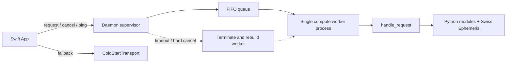

# TransitStudio 前后端架构重设计方案评审

> 收尾状态（2026-09-06）：保留的历史评审，阻断项尚未作为架构迁移任务实施。当前功能修复不代表原重设计规格已获批准。统一入口：current-status.md。

> 评审日期：2026-08-13  
> 被评审文档：`docs/architecture-redesign.md`  
> 评审性质：源码对照、只读架构评审；未实施重构  
> 总体判定：**Conditional Go（方向有条件通过，当前实施规格不通过）**

---

## 1. 执行摘要

原方案对项目主要结构性问题的判断基本准确，推荐继续保留以下总体方向：

1. Swift 与 Python 之间建立明确的 transport 抽象。
2. 保留 cold-start 进程作为正确性兜底，同时探索本地常驻后端。
3. 将 `ContentView` 中的业务状态迁往值类型 State、Reducer 与显式 Effect。
4. 按模式做垂直切片迁移，不进行一次性大爆炸重写。
5. 固化现有 JSON、结果标签页、AI 流式和导出行为，通过自动化回归保护迁移。

但当前稿件仍属于架构意图与决策稿，尚未达到可安全施工的迁移规格。按原路线直接进入阶段 0/1，存在以下五类高风险：

- 常驻进程中的 Swiss Ephemeris 全局状态会被并发或错误缓存污染，可能直接算错黄经。
- 同步 Python 计算无法按文档描述被“杀掉协程”，取消、超时、ping 和 shutdown 的控制面没有闭环。
- 默认把 cold-start 输出改成 envelope 会无协商破坏现有 CLI、fixture、Python 测试和 Swift `Decodable` 契约。
- mini-TCA 的任务身份、取消命令、迟到响应、共享状态和全局运行所有权尚未建模。
- 导出中间表示漏掉当前产品真实的 JSON 格式，也不足以表达现有 Markdown/CSV 的多层结构。

因此本评审的正式结论是：

> **架构方向通过；原阶段 0–5 不批准原样实施。应先完成本文 P0 修订、冻结旧基线、明确执行隔离与协议状态机，再进入无缓存 daemon 和首个前端样板。**

## 2. 评审范围与方法

本次评审覆盖：

- 原设计稿的目标、原则、daemon、协议、缓存、契约、mini-TCA、状态划分、AI 流式、导出、打包、测试和迁移阶段。
- 当前 Swift 调用链，包括 `BackendClient`、`RectifyClient`、`CalculationViewModel`、`ContentView+RunActions`、AI streaming 和结果导出。
- 当前 Python 后端入口、dispatcher、runtime option、Swiss Ephemeris 全局配置、progress 写入和模式模块。
- 当前 `Examples/`、Swift fixtures、JSON Schema、Python/Swift 测试、CI、本地门禁和打包脚本。
- 当前 Git 工作区边界。

本次没有修改产品代码，没有运行完整构建或测试。结论来自源码、既有测试、文档、Git 状态与只读诊断。原设计稿保持不变，便于后续逐项对照修订。

## 3. 现状事实校正

原方案的量化方向准确，但实施前应修正以下事实：

| 项目 | 原方案表述 | 源码核验结果 |
|---|---|---|
| ContentView 状态 | 149 个 `@State` | 当前是 146 个 `@State` + 3 个 `@StateObject` |
| Python 模块 | 67 个 | 当前 backend 目录共有 67 个 `.py` 文件，数量成立，但不能据此承诺“其余 66 个零改动” |
| 通用超时 | 300 秒 | `BackendClient` 为 300 秒；Rectify L1/L2/L3 专用 client 为 60 秒；Evidence 复用 300 秒 runner |
| 导出格式 | markdown/plain text/csv | 产品标准工具栏实际是 Markdown / JSON / CSV |
| schema 覆盖 | 已有 4 个种子 | 当前确有 4 份 JSON Schema，但仅少数模式有真实 `jsonschema.validate` 门禁 |
| P4 解决方式 | EnvironmentDoctor 解决分发脆弱 | 只能改善诊断和引导；仍依赖宿主 Python/pyswisseph，不能提供可重复运行时 |
| P5 收益 | 常驻化改善 rectify/timing 重计算 | 一次 scan/rectify 本来就在一个 Python 进程内循环；daemon 直接消除的是跨请求 spawn/import，不会自动加速单个重型请求 |

## 4. 总体评分

| 维度 | 评价 | 判定 |
|---|---|---|
| 问题识别 | P0–P5 基本命中真实结构债务 | 通过 |
| 分层方向 | App / Store / Transport / Python core 边界合理 | 通过 |
| 计算隔离 | 快速路径与全局 swe 状态冲突 | 阻断 |
| 取消与超时 | 同步计算无法按稿杀 coroutine | 阻断 |
| 缓存正确性 | 键不完整、精度变化、函数非纯 | 阻断 |
| 传输契约 | 两套 envelope 与多份 mode/schema/warnings 真相 | 阻断 |
| 旧契约兼容 | 阶段 0 默认 envelope 会破坏现有消费者 | 阻断 |
| mini-TCA | 方向合理，任务/共享状态/测试设施未闭环 | 需重写核心规格 |
| 导出统一 | 缺 JSON，IR 表达力不足，缺 golden | 需重写 |
| 渐进迁移 | 垂直切片思想正确，阶段依赖倒置 | 调整后通过 |

## 5. P0：后端正确性阻断项

### 5.1 所有计算必须进入同一个执行隔离域

原方案一方面认定 pyswisseph 并发行为未经验证，串行是唯一可证明正确的调度；另一方面又让 `moment`/`natal` 绕过队列，并把未来增加 worker 描述成配置调整。

现有内核包含下列进程级状态：

- `astro_backend_ephemeris.NO_ASTEROIDS`
- `astro_backend_ephemeris.REQUIRE_EPHEMERIS`
- `swe.set_sid_mode(...)`
- `swe.set_ephe_path(...)`
- Horary v2 内部再次设置 bundled ephemeris path

一个请求可在另一个请求计算期间修改这些状态。因此同一解释器内的快速路径或多 worker 线程不仅未经验证，而且可能直接改变另一请求的结果。GIL 是否释放不能解决进程级配置竞争。

必须将规格改为：

- 所有进入占星计算内核的请求，包括 moment/natal，统一进入一个计算隔离域。
- socket、认证、ping、cancel、排队和状态查询属于控制平面，可以并发。
- 初版计算 worker 数固定为 1，删除 fast bypass。
- 若将来需要真正并发，每个 worker 必须是独立进程，并独立配置 Swiss Ephemeris 状态。
- worker 数增加是新的架构阶段，不是配置开关。

### 5.2 必须选择可实现的取消模型

现有所有计算入口都是同步函数。Rectify、Rectification Evidence 和 Modern Timing 的 progress 点只是写 stderr，不会读取取消 token。

因此原稿的“杀掉计算协程”无法成立：

- 计算若运行在 socket/event-loop 线程，长任务期间 daemon 无法读取 cancel、ping、shutdown 或 stdin EOF。
- 计算若运行在线程池，Python 无法安全杀死正在执行的线程。
- 取消 Swift Task 或 Python coroutine 不会中断同步 swe/求根调用。

推荐首版采用 supervisor + 可杀 worker 进程：



如果选择较轻量的“控制线程 + 单 compute 线程”，则必须：

- 把 cancellation token 真实传入所有长循环和求根循环。
- 在检查点抛出专用取消异常。
- 定义 cancel grace period。
- 超过宽限仍未退出时，由 App 终止整个 daemon 并重建。

仅在文档中写“协作式取消”不足以构成实施规格。

### 5.3 首版 daemon 不应引入缓存

原缓存键 `(jd_ut 量化到秒, body_id, sidereal_flag)` 会确定性混淆不同 ayanāṃśa。

只读诊断显示，同一 JD、同一太阳、同为 `sidereal=true`：

```text
sidereal_lahiri          245.649176560
sidereal_raman           247.095477844
sidereal_krishnamurti    245.746028844
```

三次请求在原缓存键中完全相同，后两次会错误复用第一次。

此外：

- `calculate_positions` 的参数含不可哈希的 list，不能直接加 `lru_cache`。
- 返回值是可变 `list[dict]`，调用者可能污染缓存对象。
- warning、fallback、strict/warn/skip、noAsteroids 都会影响行为，函数不是无副作用纯函数。
- 将 JD 量化到秒会改变 progression、Davison 和亚秒求根语义，违反零算法变化原则。
- `build_houses` 还需要经纬度、宫制和具体 ayanāṃśa，绝不能只按 JD 缓存。

正确顺序是：

1. 无缓存 daemon 与冻结 cold-start 基线完全等价。
2. 同一 daemon 的乱序配置污染测试全部通过。
3. 再单独设计缓存并独立提交。
4. 缓存不可变底层数值，而不是公开 mutable row。
5. 键至少包含精确 JD、body code/offset、flags、具体 ayanāṃśa、星历路径/版本指纹及相关 runtime policy。
6. warning/failure/fallback 要么不缓存，要么连同可重放诊断完整建模。
7. 缓存版与无缓存版再次做 parity，并设置 entries/bytes/RSS 上限。

### 5.4 明确每请求 Swiss Ephemeris 生命周期

当前 `main()` 每次请求都会：

1. 解析 runtime options。
2. 配置 asteroid/ephemeris policy。
3. 设置 ephemeris path。
4. 分发计算。
5. 在 `finally` 中调用 `swe.close()`。

原稿只提出抽取 `handle_request`，没有说明这些 setup/cleanup 属于谁。应将公共入口明确拆为：

```text
validate_request
prepare_request_runtime
dispatch_request
serialize_result
cleanup_request_runtime
```

并规定 cleanup 在 success、validation error、cancel、timeout 和 internal error 上都执行。对于不可恢复的 Swiss Ephemeris 状态，应区分“本任务失败”和“worker 必须回收”。

## 6. P0/P1：协议与契约阻断项

### 6.1 保持 cold-start 默认裸结果契约

当前公开约定是：`transit_calc.py` 从 stdin 读取一个 JSON 请求，向 stdout 输出模式裸结果。Swift `BackendClient.run` 直接把 stdout 解码成泛型 `Response`。

若阶段 0 默认将其改为 `{schema,data,warnings,meta}`，会无协商破坏：

- CLI 调用。
- Python contract tests。
- fixture 生成命令。
- 所有 Swift `Decodable`。
- 读取结果顶层字段的脚本或人工流程。

推荐边界：

- `transit_calc.py` 默认继续输出当前裸结果。
- daemon transport 使用 envelope。
- `ColdStartTransport` 在 Swift 内把裸结果适配成统一内部事件。
- CLI envelope 如确有价值，只能通过显式 `protocolVersion` 或命令参数 opt-in。

### 6.2 只保留一套 TransportEnvelope

原稿的协议示例把 `schema` 写成字符串，并包含 `type/request_id`；契约章节又把 `schema` 写成对象，却省略 `type/request_id`。同时存在 outer/inner mode、schema、warnings 多份真相。

建议明确三层：

```text
TransportEnvelope
  protocol_version
  type
  request_id
  attempt_id
  event | response | error

DataSchemaRef
  id
  version

DataPacket
  当前模式原有结果
```

规则必须包括：

- `request.mode` 是唯一 mode 真相；兼容期若 outer/payload 重复，必须验证严格相等。
- transport schema 与 data schema 不共用字段名和语义。
- calculation warnings 与 transport warnings 分开命名，避免双源。
- 每个 request ID 最多一个 terminal response/error。
- terminal 后禁止再发 progress。
- 每个连接设置最大 frame、握手超时、连接数与 backpressure 策略。

### 6.3 先冻结旧 oracle，再抽 dispatcher

原路线在阶段 0 同时抽 `handle_request`、包 envelope、重生成 fixture，阶段 1 才做 daemon/cold parity。这会产生共同错误盲区：两条路径都调用同一个已改坏的函数，parity 仍然全绿；覆盖旧 fixture 又会把漂移写成新基线。

正确流程：

1. 冻结重构前 success、error、stderr/exit status 和导出 golden。
2. 只抽 `handle_request(request)`。
3. 不改变默认 wire format。
4. 用旧 golden 验证纯抽取完全等价。
5. 再添加 daemon transport。
6. 第一阶段禁止整体重生成旧 fixture。

### 6.4 定义严格的 canonical comparator

“深比较 JSON（忽略顺序）”过于模糊。正确比较规则应是：

- 仅忽略 JSON object key order。
- 数组顺序必须保持；houses、events、timeline、候选列表顺序属于产品契约。
- 数值、字段存在性与 `null` 精确比较。
- 只白名单忽略 transport-only 元数据，例如 backend、elapsed、PID、port、attempt ID。
- 禁止递归排序所有数组。

### 6.5 schema 目录必须有机器可执行门禁

“每模式一份 schema”不是充分模型。一个 mode 可能有多个 variant，例如 Horary v1/v2、scan kind、不同 return body 或 packet version。

阶段完成条件应包括：

- 机器可读的 `mode + variant -> schema ID` manifest。
- 每个 sample 输出通过对应 JSON Schema。
- schema 文件本身通过 meta-schema 检查。
- 返回的 data schema 与 manifest/registry 一致。
- additive 与 breaking change 具有兼容性测试。
- error envelope、schema mismatch、unknown schema fallback 有测试。

## 7. P0/P1：mini-TCA 与状态所有权

### 7.1 Effect 必须显式区分 run 与 cancel

原定义只有 `id` 与 `run` closure，无法表达取消命令，也没有稳定任务身份和迟到响应防护。

建议最低模型：

```swift
enum Effect<Action: Sendable>: Sendable {
    case run(
        id: EffectID?,
        cancelInFlight: Bool,
        operation: @Sendable (_ send: @escaping @MainActor (Action) -> Void) async -> Void
    )
    case cancel(id: EffectID)
}
```

还必须定义：

- `EffectID` 是稳定、类型化的 `Hashable & Sendable`。
- 每次实际请求另有 `requestID`。
- 同 ID 是否 cancel-in-flight。
- Store 清理任务时比较内部 task token，旧任务不能误删同 ID 新任务。
- progress/success/failure/cancel Action 全部携带 requestID。
- Reducer 拒绝非当前 requestID 的迟到事件。

原稿“一次 reducer 至多一个 Effect”与返回 `[Effect]` 也应统一；实际交互常需要同时 cancel 旧 effect、持久化和启动新 effect。

### 7.2 先画根状态图，再迁首个模式

现有业务状态不是独立 mode 岛：

- Moment/Scan/Rectify/Classical/Vedic 共享出生盘输入。
- Horary/KP 共享提问上下文。
- Composite/Davison/Midpoint 结果会成为 Timing 输入。
- Classical 扩展缓存多个结果并支持 merge export。

SwiftUI `onChange` 依赖 View 生命周期，没有可靠初值回放，也不能构造原子请求快照，不适合作为 Store 总线。

建议先建立根 `AppFeature`，至少包含：

```text
AppFeature.State
  navigation
  session
  chartContext
  questionContext
  runCoordinator
  natal
  moment
  scan
  horary
  kp
  rectify
  vedic
  classical
  modern
```

其中：

- `ChartContextState` 持有共享出生盘与共同计算配置。
- `QuestionContextState` 持有 Horary/KP 共享问题、时刻、地点和坐标。
- `RunCoordinatorState` 持有当前全局 request owner、stoppability 与顶栏停止语义。
- 子 reducer 通过父 reducer 和不可变 snapshot 协调跨域行为。

这一步必须早于 Moment 样板，否则 MomentStore 会立刻遇到“出生信息归 NatalStore、又禁止跨 Store 读取”的矛盾。

### 7.3 RunState 应保存正交状态

现有 `idle/running/finished/failed` 排他枚举不能表达当前 UX。当前产品需要同时保留：

- 上一次成功结果。
- 当前重算 activity。
- progress、label、stoppable。
- warning。
- 最新 failure。
- request generation/ID。

推荐：

```swift
struct RunState<Result> {
    var result: Result?
    var activity: Activity?
    var warning: String?
    var failure: Failure?
}
```

各模式自行决定新请求开始时是否清除旧结果；Horary/KP 与多数其他模式可以保留不同策略。

### 7.4 保留全局 RunCoordinator

当前顶栏停止按钮绑定的是“启动当前任务时的 stoppability”，而不是当前页面；切页后仍能停止正确任务。拆为 ModeStore 后必须保留这个跨页面契约。

RunCoordinator 至少负责：

- 全局 active request owner。
- 新计算是否取消旧计算。
- 迁移期 legacy `CalculationViewModel` 与新 Store 的互斥桥接。
- 切页后顶栏进度/停止语义。
- stale request invalidation。

### 7.5 mini-TCA 第一版必须提供测试设施

以下能力不是未来增强，而是本次迁移的基础：

- 可注入 `Clock`/Sleeper，用于 100ms throttle、debounce 和 timeout。
- 可注入 UUID/request ID generator。
- TestStore 或 effect action recorder。
- effect draining 与取消断言。
- scoped ViewState 与 Equatable 去重。
- Binding-to-Action 支持，避免为 146 个输入手写宽刷新 Binding。
- targeted strict-concurrency 编译门禁。

否则“Reducer 纯函数测试 AI 节流和取消竞态”无法实现，只能用真实 sleep，测试会抖动。

## 8. AI 流式迁移要求

原稿把 `streamBuffer` 内嵌到每模式 `AIState`，同时 Store 发布整个 State。这会使每 100ms chunk 导致整个 ModeState 发布，恢复刚修复的宽范围刷新和大 String 复制。

应保留当前关键性能契约：

- 热 buffer 独立于宽业务 State。
- 只有 AI 视图观察 hot stream。
- text 与 reasoning 分开。
- chunk 在 Effect 内节流，末尾必须 flush pending delta。
- stable surface ID 与 per-run analysis request ID 分开。
- network failure 保留 partial text/reasoning。
- empty response、failure、cancel、normal completion 明确区分。
- `AsyncThrowingStream.continuation.onTermination` 取消底层 producer/URLSession。

建议 Action：

```text
started(requestID)
chunk(requestID, text, reasoning)
completed(requestID, finalText, finalReasoning)
failed(requestID, partialText, partialReasoning, message)
cancelled(requestID, partialText, partialReasoning)
```

## 9. 导出统一修订

### 9.1 JSON 必须保持独立无损路径

当前标准工具栏是 Markdown / JSON / CSV。原 IR 只有 markdown/plainText/csv，遗漏 JSON。

JSON 不能通过 Section rows 重建：

- Horary/KP/Rectification Evidence 是嵌套数据包。
- 部分模式直接导出完整 `Encodable`。
- 部分模式存在裁剪或重新组织后的专属 JSON，例如 natal export。

因此 JSON 应保留 canonical `Encodable` 或 raw packet 路径，并用 canonical JSON/逐字节 golden 验证。

### 9.2 Markdown/CSV 需要 typed block IR

`title + [[String]] + prose` 不足以表达：

- 多级 heading。
- 多张不同表头的 table。
- list、code、warning、metadata。
- 章节筛选与标题降级。
- Classical expansion 跨模式 merge。

建议 IR 至少包括：

```text
heading(level, text)
prose(text)
list(items)
table(columns, rows)
code(language, text)
warning(text)
metadata(key, value)
section(id, children)
```

### 9.3 先建立真实 golden，再宣称逐字符兼容

现有测试大多只检查 `contains`、CSV 首行或行数，不能证明 byte-for-byte parity。迁移前应为每个模式建立：

- Markdown golden。
- JSON golden/canonical JSON。
- CSV golden。
- 章节筛选 golden。
- expansion merge golden。

阶段 2 的 Moment 应继续使用旧 exporter 或 legacy adapter；不能在阶段 2 要求 `ExportSections`，阶段 4 才引入 ExportEngine。

## 10. daemon 生命周期与安全

### 10.1 首版不建议使用全局 port 文件共享 daemon

当前进程通过私有 stdin/stdout/stderr 通信；改为 loopback TCP 后攻击面和生命周期模型确实发生变化。固定 `daemon.port` 尚未定义：

- token 谁生成、如何安全传递。
- 文件权限和原子更新。
- stale port、端口复用、owner PID/start time。
- 两个 App 实例同时启动。
- 一个 App 退出是否关闭另一个实例的 daemon。
- cancel/shutdown 的 session 所有权。
- 最大 frame、握手超时和连接上限。

推荐第一版不做跨 App 共享：

- App 生成高熵 secret 和 instance ID。
- 通过父子私有 bootstrap pipe 传给 daemon。
- daemon 通过该 pipe 返回实际端口。
- 不写全局 port 文件。
- 所有控制帧必须认证并绑定 session。

如果以后要求共享 daemon，应单独设计进程锁、原子状态文件、引用生命周期和多实例测试。

### 10.2 schema catalog 不能代替 build identity

两个后端版本可能支持完全相同的数据 schema，却包含不同算法 bugfix。握手仅比较 schema 列表不能判断是否为当前 App 对应的后端。

握手至少包括：

- transport protocol version。
- App build/version。
- backend build ID 或 resource tree hash。
- Python executable realpath/version。
- pyswisseph version。
- daemon instance ID。
- capability/data-schema catalog。

schema 只回答“能否解码”，build identity 才回答“是不是当前代码”。

### 10.3 自动重放需要 exactly-once 状态机

连接断开可能发生在计算完成但 response 尚未抵达时。无条件重放会重复执行；cancel 与 reconnect 并发时还可能复活已取消请求。

每个请求需要：

- logical request ID。
- attempt ID。
- queued/running/cancelling/terminal 状态机。
- terminal at most once。
- cancel 后不得自动重放。
- 旧 attempt 的 event/terminal 丢弃。
- 只有明确幂等的计算请求可自动重试。
- circuit breaker/backoff，避免每次请求都重复 daemon 崩溃流程。

建议首版先不自动重放：断线后本次请求失败或显式走 cold fallback。等 exactly-once 与故障注入测试完成后，再启用受控重试。

### 10.4 idle timeout 不是完整资源上限

连续使用时 daemon 永不 idle，所以十分钟自退不能限制按 job 增长的内存或 Swiss 资源。

还应定义：

- idle 只在 `active == nil && queue.empty` 时开始。
- 最大 uptime。
- 最大 job 数。
- cache entries/bytes 上限。
- RSS 上限与 graceful recycle。
- 活跃请求期间不得触发 idle exit。

## 11. EnvironmentDoctor 的正确定位

EnvironmentDoctor 值得保留，但应从“解决 P4”改为“缓解 P4、提供诊断和明确支持矩阵”。建议检测：

1. 配置的 Python executable 是否存在、可执行且版本满足要求。
2. 该确切解释器能否 `import swisseph`。
3. pyswisseph 版本。
4. packaged backend 最小真实 smoke 是否成功。
5. bundled/外部 ephemeris 路径和关键文件可达。
6. backend build 与资源版本。

安装命令必须绑定当前配置解释器：

```text
<configured-python> -m pip install pyswisseph
```

不能笼统复制 `pip3 install pyswisseph`，否则可能安装到 App 未使用的另一个解释器。

## 12. 修订后的迁移路线

### 阶段 -1：仓库隔离、冻结基线与 ROI spike

内容：

- 将方案与评审从当前 KP 未提交工作区隔离为独立文档提交或分支。
- 冻结所有 sample success 输出、error 输出、stderr/exit status 和 fixtures。
- 冻结 Markdown/JSON/CSV 导出 golden，包括章节筛选与 merge。
- 定义 canonical JSON comparator。
- 建立真实 timeout matrix：startup、queue wait、execution、cancel grace、transport read。
- 做无缓存 daemon spike，量化 spawn/import 占比、连续请求收益、100/1000 job RSS 和实际缓存候选命中率。

完成判据：旧 oracle 不会在后续重生成中丢失；有数据证明 daemon 复杂度对应实际收益。

### 阶段 0A：纯抽取 dispatcher

内容：

- 抽取 `handle_request(request)`。
- 明确 validate / prepare runtime / dispatch / cleanup。
- 保持 `transit_calc.py` 默认 stdout、stderr、exit status 和裸结果完全不变。
- 不添加 envelope，不启用缓存，不整体更新 fixture。

完成判据：全部冻结成功/错误基线完全一致。

### 阶段 0B：契约目录

内容：

- 建立机器可读的 mode+variant schema manifest。
- 补 schema 自身 meta-validation。
- 所有 sample 通过对应 JSON Schema。
- Swift ContractRegistry 与 unknown-schema fallback 上线，但不改变默认 CLI wire format。

完成判据：每个已登记 variant 都能从 manifest 找到唯一 schema，实时输出与 schema/registry 一致。

### 阶段 1A：无缓存 daemon transport

内容：

- supervisor/control plane + 单计算 worker。
- 所有计算统一排队，不设 fast bypass。
- 私有 bootstrap、认证、build identity、frame/connection limits。
- 唯一 TransportEnvelope。
- ColdStartTransport 继续适配裸 result。
- 首版不启用缓存和自动重放。

完成判据：全部正常与错误样例 cold/daemon 等价；长任务期间 ping/cancel 控制面可响应。

### 阶段 1B：故障与顺序 parity

内容：

- tropical/Lahiri/Raman/Krishnamurti 交替。
- ephemeris path A/B/A。
- noAsteroids 与 requireEphemeris 切换。
- Horary v2 与其他模式交替。
- cancel/timeout/crash 后执行下一请求。
- malformed/split/coalesced/oversized NDJSON。
- terminal exactly once、terminal 后无 progress、cancel 不重放。
- stale bootstrap、多实例、backpressure 和 build mismatch。

完成判据：同一 daemon 的每一步结果都与全新 cold process 对应结果一致；无状态污染。

### 阶段 1C：可选缓存

内容：

- 独立设计、独立提交。
- 精确 JD 与完整配置指纹。
- immutable cached value。
- cached/uncached parity。
- entries/bytes/RSS/recycle 上限。

完成判据：启用缓存不能改变任何冻结结果、错误或 warning 语义。

### 阶段 2：根状态与 mini-TCA 基础设施

内容：

- AppFeature 根状态。
- ChartContext、QuestionContext、Navigation、RunCoordinator。
- 显式 `.run/.cancel` Effect、stable EffectID、per-run requestID。
- Clock、UUID、TestStore、scoped observation、BindingAction。
- AI hot buffer 继续隔离。
- 建立 legacy `CalculationViewModel` 与新 Store 的运行互斥桥。
- 首个 Moment Feature 继续复用旧 exporter。

完成判据：Moment 等价、顶栏停止与切页语义不变、旧请求无法写回新状态、所有时间测试不依赖真实 sleep。

### 阶段 3：按垂直切片迁移模式

每个模式同时验证：

- 请求编码。
- 结果解码。
- result tabs 与 selection normalization。
- run ownership、cancel、stale response。
- AI stream key/request ID。
- persistence。
- 跨模式 handoff。

建议从低风险普通模式开始，再迁 Scan、Rectify、Horary 等复杂模式。每个 PR 必须明确其跨模式消费者，不能假设回归只影响本模式。

### 阶段 4：导出统一

内容：

- JSON 保持独立无损路径。
- Markdown/CSV 引入 typed block IR。
- 逐模式与 golden 比较。
- 覆盖章节筛选和 expansion merge。
- 一个模式完成切换后才删除对应旧 builder。

完成判据：三种真实用户格式保持等价，且没有由 Section IR 重建 JSON。

### 阶段 5：收尾

内容：

- 删除 ContentView 持有的业务状态。
- 删除旧 CalculationViewModel、RectifyClient 和 legacy bridge 残留。
- 保留明确列出的 UI/lifecycle chrome state。
- 静态扫描业务 `@State`、旧 client/store 调用和 default tab fallback。

完成判据应写为“业务状态不再由 ContentView 持有”，不能写成“所有 `@State` 归零”。

## 13. 开工门禁

进入 daemon 实现前必须全部满足：

- [ ] 默认 `transit_calc.py` 裸输出兼容策略已确认。
- [ ] 重构前 success/error/export golden 已冻结且不可被第一阶段覆盖。
- [ ] 单一 TransportEnvelope、data schema 与 warnings 所有权已定稿。
- [ ] 计算执行隔离明确，删除同解释器 fast bypass。
- [ ] 取消/超时选择了可实现模型，并定义硬取消兜底。
- [ ] 首版 daemon 明确无缓存、无自动重放。
- [ ] per-request Swiss runtime setup/cleanup 已定义。
- [ ] parity comparator 明确只忽略 object key order 和白名单 transport meta。
- [ ] 顺序污染测试矩阵已写入测试计划。
- [ ] bootstrap、认证、build identity、多实例策略已定义。

进入首个 mini-TCA 模式迁移前必须全部满足：

- [ ] App 根状态和跨模式 ownership matrix 已定稿。
- [ ] ChartContext、QuestionContext 与 RunCoordinator 已定稿。
- [ ] Effect `.run/.cancel`、stable ID、request ID 和迟到事件规则已定稿。
- [ ] Clock、UUID、TestStore、scoped observation、BindingAction 可用。
- [ ] AI hot buffer 不随 ModeState 宽发布。
- [ ] legacy/new run coordination bridge 有测试。
- [ ] Moment 继续复用旧 exporter，或 ExportEngine legacy adapter 已存在。

进入导出统一前必须全部满足：

- [ ] 每模式 Markdown/JSON/CSV golden 已建立。
- [ ] JSON 独立无损路径已确认。
- [ ] typed block IR 能表达 heading/table/list/code/warning/meta/section。
- [ ] 章节筛选和 expansion merge 有 golden。

## 14. 建议保留的原方案决策

以下内容可以保留，只需按本文补充边界：

- 计算规则和既有数据语义不动。
- `BackendTransport` + daemon/cold-start 双实现。
- 抽取 `handle_request` 作为公共计算入口。
- 单向数据流、纯 reducer、显式 effect。
- 逐模式垂直迁移。
- 类型化 result tab；进一步让 tab descriptor 成为标题、可见性与渲染的唯一真相。
- AI 100ms 节流、流末一次落盘、流式期间不解析 Markdown。
- EnvironmentDoctor；定位为诊断和支持矩阵工具。
- Contract parity；补充冻结 oracle、顺序污染、错误与故障路径。
- 每阶段独立可发布、可停止和可回退的目标。

## 15. 仓库与提交边界

评审时，方案稿 `docs/architecture-redesign.md` 是未跟踪文件，位于 `codex/feature-kp-horary` 的大批未提交 KP 改动中；与此同时 `PLANS.md` 将原方案任务写成“分支：无（仅文档）”。

这会使架构文档与 KP 功能形成难以独立审查的提交边界。正式提交前应：

1. 将原方案稿、本文评审稿及对应 `PLANS.md`/`CHANGELOG.md` 记录隔离。
2. 使用独立文档提交或独立 docs 分支。
3. 不把评审文档与 KP 产品代码放入同一个逻辑 commit。
4. 原方案如需修订，建议新增“已采纳评审项”章节或生成 v2，而不是无痕覆盖评审历史。

## 16. 最终决定

**Conditional Go。**

批准继续设计与验证性 spike；不批准按原阶段 0/1 直接全面实施。下一次架构检查点应提交：

1. 修订后的执行隔离与取消模型。
2. 唯一 TransportEnvelope 和默认 CLI 兼容策略。
3. 冻结 oracle 与 canonical comparator 规格。
4. 无缓存 daemon spike 的性能/RSS 数据。
5. App 根状态、共享 context、RunCoordinator 与 Effect 任务语义。
6. JSON 独立路径和 typed export IR 规格。

这些材料通过评审后，整体方案可从“有风险的大范围重构”转为真正可回退、可判定、可分阶段发布的迁移工程。
