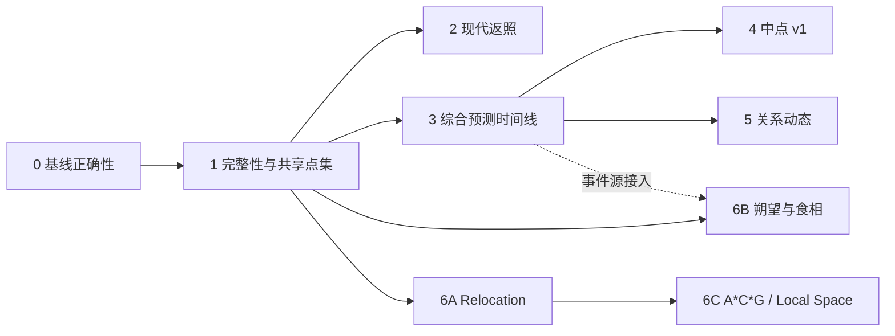

# 现代占星扩展实施蓝图（2026-07-13）

> 状态：实施前任务书 / 契约草案
> 本轮交付边界：只落文档，不修改 Swift、Python、JSON fixture、版本号或安装包。
> 选型依据：[`modern-astrology-expansion-assessment-2026-07.md`](modern-astrology-expansion-assessment-2026-07.md)

## 0. 文档目的与使用方式

上一份评估回答“还能扩展什么、优先级如何”。本文回答“按什么边界施工、每批改哪些契约、怎样证明完成”。

本文面向后续实现者、评审者和产品确认者。每一批开始前仍须：

1. 从当时的 `main` 新建独立任务分支，不直接把本文中的字段示例照抄进代码。
2. 重新查询当前模型、调用点、Swiss Ephemeris Python 绑定和测试；本文是 2026-07-13 的设计基线，不替代代码事实。
3. 把该批计划写入根目录 `PLANS.md`，代码变更写入 `CHANGELOG.md`。
4. 对本文标成 `DECISION_REQUIRED` 的口径先取得人类确认。
5. 只实现该批定义的范围；不要借机迁移全部历史响应或加入解释文本。

文中的 JSON 是**契约草案**。字段名只有在施工批次完成请求/响应模型、真实 fixture 和 Swift contract test 后才成为正式契约。

## 1. 目标结果

完成第 0–6 批后，现代占星应形成以下闭环：

- 本命盘不只显示位置和相位，还能查看盘型/图形、分布、Vertex/East Point、赤纬相位和 OOB。
- Solar Return / Lunar Return 有独立现代工作流、返照地点、双盘关系和可审计方法信息。
- 行运、次限、太阳弧能在同一预测时间线中给出入 orb、精确、离 orb、多次命中和来源方法。
- 中点不止是静态表，可以成为本命树和动态时间线的目标。
- Composite / Davison 可接入关系动态；Progressed Composite 有明确、可复算的方法。
- Relocation 和朔望/食相周期可独立使用，也可成为预测时间线来源。
- Astrocartography / Local Space 有经过方法验证的后续入口，但不挤占前述核心闭环。

这里的“完成”指计算、结构化输出、Swift 展示、导出、测试和 provenance 全部到位，不代表增加自动占星解释，也不代表对占星有效性作科学背书。

## 2. 明确不做

本路线当前不包含：

- 大段自动解释、AI 结论或“吉凶评分”。结构化数据稳定后再接现有 AI 层。
- Sabian Symbols、度数词典或来源/授权未确认的文本库。
- 继续堆默认小行星名称。项目已有自定义小行星编号，应先统一跨模式 point set。
- Uranian 八颗假想星、完整 planetary pictures 和 90° dial；先完成普通中点基础。
- Persona、Heliocentric、固定星 parans/heliacal、行星交点/拱点、geodetic/Johndro、tertiary/minor progression 等 P3 技法。
- 将全部技法塞入一个超大 mode 或一个无法分层筛选的结果页。
- 在新功能提交中顺手改变古典 `planetary_returns` 契约、Horary 口径、Vedic 口径或现有 scan 输出。

## 3. 当前基线与必须保留的合同

### 3.1 已确认的实现基线

| 能力 | 当前实现 | 后续复用方式 |
|---|---|---|
| 现代本命 | `mode=moment` + `sameChart=true`，Swift 以 `TransitResult` 展示 | 保留现有 mode；用可选字段扩展，不新造平行的本命计算链路 |
| 关系盘 | `synastry`、`composite`、`davison` | 复用双人输入、位置/宫位/相位和 `PatternResult` |
| 时间盘 | `progression`、`solar_arc`、`harmonic` | 复用单时点 snapshot；动态事件另建契约 |
| 精确搜索 | `astro_backend_scan.py` 的步进、符号换边和二分求根 | 抽取/包裹通用原语；现有 `scan` 请求和 `ScanResult` 保持兼容 |
| 返照 | 古典 `return_summary()` 可找 previous/current/next 并建完整 snapshot | 抽出“只求精确时刻”的通用 solver；古典 snapshot 和字段不迁移 |
| 位置/宫位 | `calculate_positions()`、`build_houses()`、`house_for_longitude()` | 所有新盘继续走同一星历和宫位入口 |
| 赤纬 | `PositionRow.declination/out_of_bounds`、`find_declination_aspects()` | 补 UI、point set 与跨盘调用，不重写算法 |
| 图形 | `find_patterns()` + `find_chart_shapes()` | 接入现代本命；默认仍以十大行星为 shape 集合 |
| 导出 | Markdown/JSON/CSV 三条路径 | 每个新 mode 必须同批实现三种导出和测试 |

### 3.2 不得破坏的工程合同

- Swift 仍通过 `transit_calc.py` 启动 Python，以 stdin/stdout 交换单个 JSON。
- 新 mode 必须同步 `astro_backend_api.py` 的白名单、必填校验和分发。
- 结果页 tab 名称只能来自 `(id, title)` 列表；每个 id 必须在 `selectedResultView` 有显式 `case`。
- 新 AI surface 若以后接入，必须有唯一 `streamKey`；不得恢复逐 token 写 per-mode `@Published` 或在 `body` 中反复解析 Markdown。
- `section_errors` 表示局部失败，`warnings` 表示降级/风险；计算方法降级不得静默。
- 现有模式新增字段优先使用 optional，避免旧 fixture 或旧响应无法解码。
- 后端 JSON shape 有意变化时必须重生成对应真实 fixture，并通过 `BackendContractTests`。
- 动态事件不得复用静态 `AspectHit`；二者生命周期和时间字段不同。

### 3.3 已确认的第 0 批债务

| ID | 问题 | 证据 | 处理原则 |
|---|---|---|---|
| B0-01 | Composite 非 Whole Sign 必然进入 fallback | `build_houses()` 返回 3 值，`astro_backend_composite.py` 非整宫分支只接 2 值 | 只修 unpack 和聚焦回归，不在同提交重定义 Composite 宫位方法 |
| B0-02 | 推进月相无法区分盈亏 | `_calc_lunation()` 用 `angular_separation()`，结果只有 0…180° | 用有向 Moon−Sun 周期角选择八相；保留现有响应字段兼容 |

## 4. 批次、依赖与任务边界

规模：`S` 为聚焦修复；`M` 为一个新响应或完整页面；`L` 为跨后端/Swift/导出的完整 mode；`XL` 为跨模式事件或地图工作流。规模不是日历工期。

| 批次 | 建议分支 | 规模/风险 | 前置 | 交付边界 |
|---|---|---|---|---|
| 0 现代基线正确性 | `codex/fix-modern-baseline-correctness` | S / 低 | 无 | Composite 非整宫、推进盈亏月相；不加新功能 |
| 1 现代完整性与共享点集 | `codex/feature-modern-completeness` | L / 中 | 0 | point set、结构层、Vertex/East Point、赤纬/OOB、关系点集补全 |
| 2 现代返照 | `codex/feature-modern-returns` | L / 中 | 0、1 | Solar/Lunar Return、地点、overlay；不做其他行星返照 |
| 3 综合预测时间线 | `codex/feature-modern-timing` | XL / 高 | 0、1 | Transit/Progression/Solar Arc 精确事件与生命周期；保持旧 scan |
| 4 中点 v1 | `codex/feature-modern-midpoints` | L / 中 | 1、3 | 360° 本命中点轴/树、动态命中；不做 Uranian 假想星 |
| 5 关系动态 | `codex/feature-relationship-timing` | XL / 高 | 0、1、3 | Transit→Composite/Davison、Progressed Composite；争议变体分阶段 |
| 6 地理与周期 | 按 6A/6B/6C 各自分支 | M–XL / 中高 | 1；6B 可接 3 | Relocation、朔望/食相；A*C*G/Local Space 独立 epic |



说明：6B 可以先独立交付，也可以在第 3 批完成后注册为时间线事件源；不得为了接时间线而阻塞其独立周期结果。

## 5. 跨批共享设计

### 5.1 模块边界

建议新增或抽取以下职责，最终文件名在施工前再次核对：

| 职责 | 建议落点 | 约束 |
|---|---|---|
| point set 解析与校验 | `astro_backend_modern_points.py` | 内部继续调用 `resolve_bodies()`，不复制 `BODY_REGISTRY` |
| 通用现代 chart snapshot | `astro_backend_modern_chart.py` | 组合 `calculate_positions/build_houses/find_aspects/find_patterns`；不带解释文案 |
| 返照精确时刻 solver | `astro_backend_return_solver.py` | 从古典搜索提取纯求根；古典 `return_summary()` 继续维持原响应 |
| 动态事件引擎 | `astro_backend_modern_timing.py` | technique adapter + bracket/refine + lifecycle + grouping；不复用 `ScanHit` schema |
| 中点 | `astro_backend_midpoints.py` | 复用 `circular_midpoint()`，输出轴与 trace |
| 地理/周期 | `astro_backend_relocation.py`、`astro_backend_cycles.py` | Relocation 与 eclipse/lunation 分开，地图 epic 再单列 |

`find_aspects()` 当前位于 `astro_backend_scan.py`，却被多个 snapshot 模块导入。第 1 或第 3 批可把它迁到共享模块，但必须先：

1. 保留 `astro_backend_scan.find_aspects` 兼容 re-export，避免一次改遍所有调用方。
2. 用现有现代关系/时基测试证明输出排序、去重和 ID 未漂移。
3. 不把迁移与相位算法改规则放在同一提交。

### 5.2 共享 point set 契约草案

新现代 mode 和逐步升级的高级现代 mode 使用可选 `point_set`：

```json
{
  "point_set": {
    "body_ids": ["SUN", "MOON", "MERCURY", "VENUS", "MARS", "JUPITER", "SATURN", "URANUS", "NEPTUNE", "PLUTO", "CHIRON"],
    "include_nodes": true,
    "custom_asteroids": [433],
    "angle_ids": ["ASC", "MC", "DSC", "IC", "VERTEX", "EQUATORIAL_ASCENDANT"],
    "house_cusps": [],
    "lot_ids": []
  }
}
```

规则：

- 字段省略时保持该 mode 的**现有默认点集**，保证旧 Examples 和调用方不变。
- `body_ids` 只接受 `BODY_REGISTRY` 中除南北交点外的实体/虚点 ID；`include_nodes` 决定是否加入交点，顶层 `node_mode` 决定真/平均口径。直接在 `body_ids` 混入与 `node_mode` 冲突的 node ID 应返回 validation error。
- `custom_asteroids` 继续走现有星历准备、`no_asteroids` 和 `require_ephemeris` 语义。
- 兼容 `mode=moment` 时，实际计算的小行星集合取旧顶层 `customAsteroids` 与 `point_set.custom_asteroids` 的去重并集；结构分析只取 point set 中的子集。新 mode 不再另造第二个顶层小行星字段。
- Swift 发现 point set 含自定义小行星时，必须调用现有 `prepareAsteroidsIfNeeded()`，不能像当前高级现代 run action 一样只传 `normalizedEphemerisPath`。
- `angle_ids` 只接受已实现轴点；未知 ID 是 validation error，不得忽略。
- `house_cusps` 使用 1…12 的整数数组；空数组表示不作为相位目标，不表示不计算宫位。
- `lot_ids` 第一阶段只接已有、可追溯公式的点；现代模式不默认加入古典 Lots。
- 返回 `meta.effective_point_set`，记录实际算入的 ID；星历缺失或出生时间降级造成的删减必须同时写 warning。
- 图形、分布、相位各自记录使用的 point subset，不能让 UI 选择集与后端分析集不一致。

迁移默认：

| 模式 | `point_set` 省略时 |
|---|---|
| 现代本命 | 旧调用回退到请求中的 `natalBodies`；新版 Swift 始终另传当前 UI 可见 analysis point set，shape 默认十大行星 |
| Synastry/Composite/Davison | 十大行星 + `node_mode` 对应南北交点 |
| Progression/Solar Arc/Harmonic | 十大行星 + `node_mode` 对应南北交点 |
| Modern Return | 十大行星 + `node_mode`；返照目标仅 SUN 或 MOON |
| Modern Timing | 目标默认采用当前本命选择；移动体由每个 technique 显式给出 |

### 5.3 通用 chart snapshot 草案

新增 mode 若需要嵌套一张完整盘，统一使用：

```json
{
  "chart": {
    "angles": [],
    "houses": [],
    "planets": [],
    "aspects": [],
    "declination_aspects": [],
    "fixed_star_conjunctions": [],
    "patterns": []
  }
}
```

- `planets` 继续使用 `PositionRow` 语义；轴点继续使用 `ClassicalPoint` 语义，不强行揉成一个宽表。
- Swift 新增可复用 `ModernChartSnapshot`，供 Return、Relocation 和以后关系 snapshot 使用。
- Composite/Davison 现有平铺响应不在第 1 批强迁移；可让它们继续 conform `ChartResultFields`。
- snapshot 只放单时点结构。进入/精确/离开等动态信息只能放 `ModernTimingEvent`。

### 5.4 方法与 provenance

真正通用的字段可以 optional 方式扩展 `ModernMeta`；时间线使用独立 `ModernTimingMeta`。目标信息如下：

```json
{
  "meta": {
    "schema_version": 1,
    "method": "secondary_progression_day_for_year",
    "zodiac": "tropical",
    "house_system_requested": "placidus",
    "house_system_effective": "placidus",
    "node_mode": "true_node",
    "display_timezone": "Asia/Shanghai",
    "ephemeris": "Swiss Ephemeris",
    "effective_point_set": {},
    "calculation_assumptions": {}
  }
}
```

必须区分 requested/effective。宫制、星历、位置或点集发生 fallback 时，响应不得只留下最终值而不说明原因。

### 5.5 时间语义

- 所有求根以 UTC aware `datetime` 和 Julian Day 运算。
- JSON 的 `*_utc` 使用完整 ISO 8601（含 `Z` 或 `+00:00`），不再输出缺少 offset 的模糊字符串。
- `*_local` 使用 `display_timezone` 转换并保留 offset；不能只输出 `YYYY-MM-DD HH:mm` 而不说明时区。
- 返照地点的 timezone 只负责显示当地时间；返照精确 UTC 由天体回到本命黄经决定，与地点无关。
- Relocation 保持原出生 UTC，不得用新地点时区重新解释出生表盘时间。

### 5.6 出生时间质量与降级

`DECISION_REQUIRED`：当前 `ChartMoment` 强制 hour/minute，产品没有“未知生时”状态。推荐在正式扩展角点/地理工作流前，为现代输入加入 `time_accuracy`：`exact | approximate | unknown`。

| 质量 | 可用 | 降级/禁用 |
|---|---|---|
| exact | 全部 | 无 |
| approximate | 行星、相位可算 | 角点/宫位/Vertex/Relocation/关系互落宫加醒目标记；不声称秒级事件精度 |
| unknown | 除月亮外变化较慢的日期级行星可在确定的 noon convention 下算 | 默认隐藏角点、宫位、Vertex/East Point、locality；月亮和月亮相关精确事件标为不可靠或排除 |

任何 noon convention 都必须进入 `meta.calculation_assumptions`。若本产品暂不支持未知生时，则 UI 和文档应明确“必须提供生时”，而不是假装已降级。

### 5.7 动态事件契约草案

一个 `ModernTimingEvent` 表示一个完整 pass，而不是三个互不关联的“进入/精确/离开”行：

```json
{
  "id": "transit|SATURN|conjunction|ASC|20300115T031522Z",
  "group_id": "transit|SATURN|conjunction|ASC",
  "source_type": "transit",
  "event_type": "aspect",
  "moving_point_id": "SATURN",
  "moving_point_name": "土星",
  "target_point_id": "ASC",
  "target_point_name": "ASC",
  "target_point_kind": "angle",
  "aspect_id": "conjunction",
  "aspect_name": "合相",
  "aspect_angle": 0.0,
  "orb_limit": 1.0,
  "entering_utc": "2030-01-10T04:11:02Z",
  "exact_utc": "2030-01-15T03:15:22Z",
  "leaving_utc": "2030-01-20T08:02:41Z",
  "exact_local": "2030-01-15T11:15:22+08:00",
  "motion": "retrograde",
  "moving_longitude": 123.456,
  "target_longitude": 123.456,
  "exact_orb": 0.0,
  "pass_index_in_window": 2,
  "pass_count_in_window": 3,
  "window_clipped_start": false,
  "window_clipped_end": false,
  "method_key": "transit_longitude_bisection"
}
```

规则：

- `event_type=aspect` 才要求 target/aspect/orb 字段；station/ingress/lunation/eclipse 可为 `null`。
- entering/leaving 求 `abs(orb)-orb_limit=0`；exact 求指定相位分支的 signed distance=0。
- entering/leaving 表示“包含该 exact 的连续入-orb 区间”。若一次逆行循环在未离开 orb 的情况下产生多个 exact，它们可以共享同一 entering/leaving；不得为每个 exact 伪造互斥窗口。
- 扫描边界截断 lifecycle 时对应时间可为 `null`，并设置 clipped flag，禁止伪造边界时间。
- `pass_count_in_window` 只声明“本次查询窗口内同 signature 的命中数”，不声称窗口外没有更多命中。
- `group_id` 不含本地时间；`id` 使用语义字段 + UTC 秒，避免时区/文案变化导致 ID 漂移。
- 排序首先按 `exact_utc`，UI 的优先级筛选不能改变导出中的时间事实。

### 5.8 错误、空结果和兼容

- 不支持的 mode/字段/枚举：顶层 validation error。
- 某 technique 全部失败：`section_errors[technique_id]` + warning；其他 technique 可返回。
- 合法但无命中：空数组，不是 error。
- 星历 fallback：warning + `meta.ephemeris`；strict 模式继续失败。
- 现有字段重命名必须走迁移期；优先新增 optional 字段，不在新 mode 开发中清理旧命名。
- 所有响应继续 `allow_nan=False`，经纬度、orb、年份、harmonic order 等先做有限值/范围校验。

### 5.9 Swift、结果页、导出和 AI

- 每个新 mode 同批增加 Request/Result、BackendClient、run action、sidebar、result pane、Markdown/CSV/JSON 和 contract fixture。
- 新结果 tab 必须写入 tab list 和 `selectedResultView` case，并在 `ModernTabStateTests` 覆盖默认 tab。
- 事件 CSV 使用事件专用列，不硬塞现有十列 `modernCSVHeader` 而丢失 UTC、pass 和方法。
- JSON 导出应等于结构化响应，不再像当前现代本命 `natalJSON` 那样丢掉角点、宫位、赤纬相位和固定星。
- 第一版新功能不接 AI。以后接入时，Return、Timing、Midpoint、Relationship Timing 分别使用独立 stream key，且先用 Markdown exporter 生成稳定上下文。

## 6. 第 0 批：现代基线正确性

### 6.1 目标

在任何新增功能前，消除两个会污染后续返照/关系/时间线结果的确定性错误。响应 shape 不变。

### 6.2 B0-01 Composite 非整宫

实现口径：

1. `build_houses()` 的返回值按 `(cusps, angles, system_label)` 正确接收。
2. 保持当前“在中间地理位置建立原始宫头，再按 Composite MC delta 平移”的方法，不在此批改成 ARMC composite。
3. 真正的 Swiss house fallback 仍写 warning；不得再出现由 unpack 编程错误触发的“已回退等宫”。
4. Whole Sign 结果不得改变。

聚焦测试：

- Placidus 请求返回 12 个非全同宫头，warnings 不含 `too many values to unpack`。
- Equal/Porphyry 各至少一个非 Whole Sign 路径。
- monkeypatch 真实制造 `build_houses` 异常时仍按既有策略回退并 warning。
- A/B 交换后 Composite 行星、ASC/MC 保持对称容差；非 Whole Sign 宫头先加 characterization test。若现有 MC-shift 方法本身不对称，记录为 D10 方法债务，不在 B0 偷换算法。

### 6.3 B0-02 推进月相

实现口径：

- `directed_phase = norm360(progressed_moon - progressed_sun)` 用于选择最近的 0/45/90/135/180/225/270/315 八相。
- `sun_moon_separation` 继续表示 0…180° 的几何最短夹角，保证现有显示兼容。
- `phase_angle` 继续表示最近的标准相位角，但现在允许 225/270/315。
- 最近相位采用圆周距离，避免 359° 离 0° 被误判很远。

聚焦测试：

| Sun | Moon | 预期 |
|---:|---:|---|
| 0° | 90° | 上弦月 / `phase_angle=90` |
| 0° | 270° | 下弦月 / `phase_angle=270` |
| 10° | 235° | 亏凸月 / `phase_angle=225` |
| 350° | 349° | 新月，跨 0° 正确 |

### 6.4 文件与验证

预计只触及：

- `astro_backend_composite.py`
- `astro_backend_progressions.py`
- `python_tests/test_modern_relationship.py`
- `python_tests/test_modern_timebased.py`
- `PLANS.md`、`CHANGELOG.md`

验收：聚焦测试、六个现代 sample、`bash check_vibe_changes.sh` 全绿；完整 diff 不含新 mode、Swift UI 或响应字段。

## 7. 第 1 批：现代完整性与共享点集

### 7.1 目标

让现代本命和高级现代模式使用一致、可审计的点集，并把后端已经具备但 UI 未完整呈现的结构、赤纬和轴点补出来。

### 7.2 范围

1. optional `point_set` 及 `effective_point_set`。
2. 现代本命 `patterns`、chart shape 和透明分布统计。
3. Vertex、Antivertex、East Point（Equatorial Ascendant）；默认 UI 先显示 Vertex/East Point，Antivertex 作为 Vertex 对点生成。
4. 现代本命赤纬相位、declination、OOB 独立结果入口。
5. Synastry 可配置双方角点/Vertex/交点/Chiron/Lilith/小行星，并支持跨盘赤纬相位。
6. Progression/Solar Arc/Harmonic/Composite/Davison 接受 point set，但省略时保持旧默认。

不包含动态事件、返照盘、关系推运或解释评分。

### 7.3 轴点来源

Swiss Ephemeris `houses` 返回的 `ascmc` 数组中，index 3 为 Vertex，index 4 为 Equatorial Ascendant。后者在现代占星中常被称为 East Point；但 Vertex 的对点 Antivertex 又是几何意义的 ecliptic east point。为避免两个“东点”混淆，内部 ID 使用 `EQUATORIAL_ASCENDANT`，UI 标签可写“East Point（Equatorial Ascendant）”。项目当前 `call_houses_ex()` 已拿到整组 `ascmc`，但 `build_houses()` 只保留 ASC/MC。

施工要求：

- 扩展内部 angle values，至少保留 `VERTEX` 和 `EQUATORIAL_ASCENDANT`。
- `ANTIVERTEX = norm360(VERTEX + 180)`，不再调用另一套算法。
- 对非 finite 值或高纬宫位 fallback 写 warning，并从 `effective_point_set` 移除该轴点。
- sidereal 时沿用同一次 `houses_ex` 的 sidereal flag；不得先算 tropical 再手减一个未记录的 ayanamsha。
- 不默认暴露 co-ascendant/polar ascendant；它们留在后续可选轴点。

依据：[Swiss Ephemeris Programming Interface](https://www.astro.com/swisseph-download/doc/swephprg.2.10.htm)。

### 7.4 本命结构层

后端对 `sameChart=true` 且 `patterns_enabled=true` 的现代本命增加 optional：

```json
{
  "patterns": [],
  "chart_profile": {
    "point_ids": ["SUN", "MOON"],
    "elements": {"fire": 0, "earth": 0, "air": 0, "water": 0},
    "modalities": {"cardinal": 0, "fixed": 0, "mutable": 0},
    "polarities": {"positive": 0, "negative": 0},
    "hemispheres": {"east": 0, "west": 0, "above": 0, "below": 0},
    "quadrants": {"q1": 0, "q2": 0, "q3": 0, "q4": 0},
    "omitted_sections": []
  }
}
```

v1 规则：

- element/modality/polarity 默认只统计十大行星，等权计数；不输出“最强元素”之类解释结论。
- hemisphere/quadrant 依赖宫位和准确生时；无可靠生时时加入 `omitted_sections`。
- pattern/shape 默认仍只用十大行星；节点、小行星和轴点只有用户显式启用分析子集时才参与 aspect pattern，chart shape 始终十大行星。
- 所有统计都返回 `point_ids`，让导出可复核分母。
- 星群阈值延用现有 3 体；若以后调整，必须成为请求参数或 meta assumption。

注意：`runModernNatal()` 当前为保留扫描目标而请求 `allBuiltinBodyIDs`，再在 Swift 过滤可见结果。新版可继续用 `natalBodies=allBuiltinBodyIDs` 生成 raw/full result，但必须另传由 `selectedNatalBodies + customAsteroids` 形成的 analysis `point_set`；结构统计不能偷用后端原始全集。

### 7.5 赤纬与 OOB

- `PositionRow` 已有 `declination`、`out_of_bounds`，不得创建重复位置模型。
- `find_declination_aspects()` 默认 orb 当前为 1°；v1 可在现代参数区增加独立 `declination_orb`，推荐默认 1°，不得借用黄经 `globalOrb`。
- Synastry 增加 `cross_declination_aspects`，ID 必须区分 A/B，避免 `SUN parallel SUN` 歧义。
- 现代本命结果新增“赤纬”tab：位置表（赤纬/OOB）+ parallel/contraparallel 表。
- OOB 是位置状态，不是相位；CSV 应分别有 `declination_position` 和 `declination_aspect` section。

### 7.6 UI 与导出

现代本命建议 tabs：

```text
wheel / natal_positions / natal_aspects / structure
more: declination / fixed_stars / diagnostics
```

Synastry 建议 tabs：

```text
cross_aspects / house_overlays / points_a / points_b
more: declination / diagnostics / json
```

必须同步修正现代本命导出缺口：

- `natalJSON` 纳入 angles、houses、declination aspects、fixed stars、patterns、chart profile。
- `natalCSV` 纳入 declination/OOB、axes、houses、declination aspects、fixed stars、patterns/profile。
- Markdown 保留现有赤纬/固定星，并增加结构层与轴点。

### 7.7 预计文件

后端：

- `astro_backend_api.py`
- `astro_backend_ephemeris.py`
- `astro_backend_patterns.py`
- 新共享 point-set/chart helper
- 六个高级现代 mode 模块（Synastry/Composite/Davison/Progression/Solar Arc/Harmonic，只接 optional point set）

Swift：

- `RequestModels.swift`
- `TransitResultModels.swift`
- `ModernResultModels.swift`
- `ContentView+RunActions.swift`
- `ContentView+SidebarSections.swift`
- `ContentView+ResultsPanes.swift`
- `ModernResultViews.swift`
- `MarkdownTransitExportBuilder.swift`
- `MarkdownModernExportBuilder.swift`
- `TextExportBuilder.swift`

测试/样例：

- 现代关系/时基 Python 聚焦测试
- 新 point set/Vertex/declination Python 测试
- `BackendContractTests`、`ModernExportTests`、`ModernTabStateTests`
- 受影响真实 fixture 与 Examples

### 7.8 验收条件

- Vertex/East Point（Equatorial Ascendant）与直接读取 Swiss `ascmc[3]/[4]` 在容差内一致。
- point set 省略时六个现有高级现代 sample 的默认天体集合不变。
- 隐藏 Chiron/小行星后，结构统计和图形不再含这些 ID。
- Synastry 能命中 A planet → B ASC/Vertex，且未知生时策略按产品决策降级。
- Markdown/CSV/JSON 三种导出都能找到赤纬、OOB 和结构数据。
- 全量门禁通过，响应新增均为 optional 或新字段已更新真实 fixture。

## 8. 第 2 批：现代 Solar/Lunar Return

### 8.1 目标与非目标

新增独立 `mode=modern_return`，v1 仅支持 `return_body_id=SUN|MOON`。Mercury/Venus/Mars/Jupiter/Saturn Return 等待 v1 稳定后再开放，避免一开始处理逆行三次返照和超长周期 UI。

不复用古典 snapshot 的尊贵、接纳、profection synthesis 等字段；只复用精确求根和现代 chart snapshot。

### 8.2 请求草案

```json
{
  "mode": "modern_return",
  "return_body_id": "SUN",
  "birth": {},
  "reference": {},
  "location_source": "birth",
  "location": {
    "name": "Shanghai",
    "latitude": 31.2304,
    "longitude": 121.4737,
    "timezone": "Asia/Shanghai"
  },
  "house_system": "placidus",
  "zodiac": "tropical",
  "node_mode": "true_node",
  "point_set": {},
  "aspects": [],
  "precession_correction": "none"
}
```

规则：

- `reference` 决定“当前周期”，后端同时返回 previous/current/next，字段语义与项目古典合同一致。
- `location_source=birth` 时后端使用出生地；`custom` 时 location 四个字段必填且经纬度校验。
- location 只影响返照角点/宫位和 local display，不影响 exact UTC。
- tropical/sidereal 的本命目标黄经与运行中天体必须使用同一 zodiac。Astrodienst 也明确 sidereal Solar Return 会得到不同返照时刻。
- `precession_correction=none` 为 v1 推荐默认；其他修正未验证前不能只做一个 UI toggle。

依据：[Astrodienst Solar Return](https://www.astro.com/cgi/h.cgi?f=gch&h=gch32&lang=e)、[Return Charts FAQ](https://www.astro.com/faq/fq_fh_return_e.htm)。

### 8.3 响应草案

```json
{
  "meta": {
    "method": "planetary_return_longitude_bisection",
    "return_body_id": "SUN",
    "target_longitude": 123.456,
    "location_source": "birth",
    "location": {},
    "zodiac": "tropical",
    "house_system_requested": "placidus",
    "house_system_effective": "placidus",
    "ephemeris": "Swiss Ephemeris"
  },
  "previous_return": {},
  "current_cycle_return": {},
  "next_return": {},
  "warnings": [],
  "section_errors": null
}
```

`previous_return`、`current_cycle_return`、`next_return` 的值均为 nullable occurrence；搜索窗口没有对应命中时返回 `null` 并给出 warning/suggested window，不返回字段齐全但数值虚假的空盘。

每个 occurrence：

```json
{
  "label": "current_cycle_return",
  "exact_utc": "2026-01-01T00:00:00Z",
  "exact_local": "2026-01-01T08:00:00+08:00",
  "return_longitude": 123.456,
  "exact_error": 0.000001,
  "chart": {},
  "return_to_natal_aspects": [],
  "house_overlay": []
}
```

### 8.4 求根与 snapshot

1. 从古典 `return_summary()` 抽出纯函数：输入 body、目标黄经、搜索窗口、zodiac，输出按 UTC 排序的 exact instants。
2. 古典函数调用新 solver 后仍组装原 `planetary_returns` schema；用现有 classical tests 防漂移。
3. Solar 搜索以生日附近周期为 bracket；Lunar 以 reference 前后约一个月寻找 previous/current/next。
4. exact tolerance 用黄经误差断言，不用“时间看起来接近生日”代替。
5. 每个 exact instant 再用返照地点建立现代 snapshot，并计算 Return→Natal 相位、返照行星落本命宫。

### 8.5 UI 与导出

新增 `ModernSubMode.returnChart`，默认 tab 为 `current_return`：

```text
current_return / biwheel / return_to_natal / house_overlay / patterns
more: previous_next / diagnostics / json
```

- sidebar：Return 类型、参考日期、地点来源/地点、宫制/黄道/交点、点集、相位。
- biwheel 复用现有 `ChartWheelData` 前应验证 endpoint ID；不能仅凭名称拼接。
- Markdown 必须写 exact UTC/local、地点、zodiac、requested/effective house、求根误差。
- CSV 每个 occurrence 独立 section，并保留 occurrence label。

### 8.6 测试矩阵

- Solar exact longitude 与 natal Sun 误差 ≤ 1e-5°。
- Lunar previous/current/next 严格按时间排序，且 current ≤ reference < next。
- 同一请求只改返照地点：exact UTC 不变，角点/宫位应变化，行星黄经不变。
- tropical 与 sidereal 分别自洽，meta 清楚记录。
- DST 切换附近 `exact_local` offset 正确。
- invalid body/location/timezone/precession enum 返回 validation error。
- 古典 `planetary_returns` fixture 与 schema test 不回归。

### 8.7 验收条件

- Solar/Lunar 两种真实 Example 均可运行，warning/section error 可见。
- 三个 occurrence 至少 current 可建完整 snapshot；搜索窗口无命中时明确 suggested window，不返回伪造空盘。
- Swift fixture、默认 tab、Markdown/CSV/JSON 测试齐全。
- 完整门禁通过；不含 Mercury 等额外返照。

## 9. 第 3 批：综合预测时间线 v1

### 9.1 目标

把当前“单时点盘”和“只列 exact scan hit”升级成可筛选、可导出、可分组的事件时间线。v1 注册：

- Transit→Natal exact aspect。
- Transit ingress / station。
- Secondary Progression→Natal exact aspect。
- Progressed Moon sign ingress；出生时间可靠时可选 house ingress。
- Progressed lunation exact 0/90/180/270，八相标签可作为派生显示。
- Solar Arc→Natal exact aspect。

Return、eclipse/lunation calendar 在各自批次完成后再注册，不阻塞 v1。

### 9.2 保留旧 scan

- `mode=scan`、`ScanRequest`、`ScanResult`、现有 Examples 和阈值语义全部保留。
- 新增 `mode=modern_timing` 与 `ModernTimingResult`。
- 可以复用步长、二分、工作量阈值、进度和取消机制，但不得向旧 `ScanHit` 硬加 lifecycle 字段后要求所有旧调用迁移。

### 9.3 请求草案

```json
{
  "mode": "modern_timing",
  "birth": {},
  "start": {},
  "end": {},
  "display_timezone": "Asia/Shanghai",
  "target_point_set": {},
  "techniques": [
    {
      "id": "transit",
      "moving_body_ids": ["JUPITER", "SATURN", "URANUS", "NEPTUNE", "PLUTO"],
      "event_types": ["aspect", "ingress", "station"],
      "aspects": [{"id": "conjunction", "name": "合相", "angle": 0, "orb": 1.0}]
    },
    {
      "id": "secondary_progression",
      "moving_body_ids": ["SUN", "MOON", "MERCURY", "VENUS", "MARS"],
      "event_types": ["aspect", "moon_ingress", "lunation"],
      "aspects": []
    },
    {
      "id": "solar_arc",
      "moving_body_ids": ["SUN", "MOON", "MERCURY", "VENUS", "MARS", "JUPITER", "SATURN", "ASC", "MC"],
      "event_types": ["aspect"],
      "aspects": []
    }
  ],
  "confirmed_heavy_scan": false
}
```

每个 technique 自带完整 aspect+orb 列表，避免一个全局 orb 被不同技法暗中缩放。

顶层响应固定为：

```json
{
  "meta": {
    "schema_version": 1,
    "start_utc": "…",
    "end_utc": "…",
    "display_timezone": "Asia/Shanghai",
    "technique_ids": ["transit", "secondary_progression", "solar_arc"],
    "target_count": 0,
    "estimated_work_units": 0,
    "ephemeris": "Swiss Ephemeris",
    "effective_point_set": {}
  },
  "events": [],
  "warnings": [],
  "section_errors": null
}
```

`events` 每个元素遵循 5.7；grouped UI 由稳定 `group_id` 聚合原始 events，不另存一份可能与 events 漂移的重复事实。

### 9.4 引擎分层

| 层 | 职责 | 输出 |
|---|---|---|
| Target builder | 将本命 bodies/angles/cusps/lots/midpoints 归一化 | 静态 `TargetPoint` |
| Technique adapter | 给定 UTC 返回 moving point longitude/speed | 连续数值 + provenance |
| Bracketing | 按移动体/技法选安全步长，捕获相位分支换边 | bracket |
| Refinement | exact、entering、leaving 分别二分/收敛 | UTC instant + residual |
| Event assembly | 组装 lifecycle、motion、位置、clipped flags | `ModernTimingEvent` |
| Group/dedupe | signature 内按 exact UTC 排序、去重、编号 | 稳定 events |

Progression adapter 必须复用 `_calc_progressed_dt()` 的 day-for-year 口径；Solar Arc adapter 必须复用当前 `true_solar_arc` 计算。不得在时间线里出现第二套年长或弧长算法。

### 9.5 lifecycle 与多次命中

- exact 搜索先按相位的两个可能黄经分支进行，0°/180° 只有一个分支。
- 对每个 exact 向两侧寻找 `abs(orb)=orb_limit`，得到 entering/leaving。
- 运动方向读取 exact 附近 speed；Solar Arc 记录 direct/converse（v1 仅 direct）。
- 同 source/moving/target/aspect 的命中按窗口内时间分组，赋 `pass_index_in_window/count_in_window`。
- retrograde 三次命中不靠“日期接近”猜测；只陈述查询窗口内同 signature 的 3 个 exact。
- exact 时间差小于求根容差且 signature 相同才去重，不能按显示到分钟的字符串去重。

### 9.6 工作量、进度与取消

- 复用现有 1.5M soft warning、2.5M confirm、5M hard limit 的产品阈值，现代 timing estimator 汇总所有 technique work units。
- estimator 的输入至少包含：时间跨度 × adapter 步数 × moving points × targets × aspect branches。
- Swift 开始前给出相同估算；后端为最终权威，避免前后端阈值漂移。
- stderr 进度使用现有 `{"progress": …}` 线路；至少按 technique/body 推进。
- 停止计算必须终止 Python 子进程、丢弃旧 generation 的迟到结果，并恢复可运行状态。

### 9.7 UI 信息架构

推荐保留顶部 `.scan` 导航，在现代 practice 下提供“精确扫描 / 综合时间线”切换；后端仍是两个独立 mode。

结果页：

```text
timeline / grouped / calendar
more: diagnostics / json
```

- timeline：按 exact local 升序，显示 technique、moving/aspect/target、进入/精确/离开、pass。
- grouped：按 `group_id` 折叠，展示窗口内 1/3、2/3、3/3。
- calendar：月/周分组，不在 v1 做复杂图形星历。
- filters：technique、event type、moving body、target kind、aspect、是否 clipped。
- 切换 filter 不修改原始 result；导出默认全量，可选择“导出当前筛选”时在文件头说明过滤条件。

### 9.8 导出

事件 CSV 最少包含：

```text
source_type,event_type,moving_point,target_point,target_kind,aspect,
orb_limit,entering_utc,exact_utc,leaving_utc,exact_local,motion,
pass_index_in_window,pass_count_in_window,exact_orb,method_key
```

Markdown 按月份和 group 输出，并在开头列出 window、timezone、technique/aspect/orb 配置和 clipped 说明。

### 9.9 测试矩阵

- 人工线性 adapter：精确验证 entering/exact/leaving 三个根与 residual。
- 0° 跨界、180°、双分支 60/90/120/150°。
- 顺行单次、逆行多次、station 附近不重复。
- scan 边界截断：时间为 null + clipped flag，而不是边界值。
- 相同时刻不同时区：exact UTC 相同，local/offset 正确。
- Progression adapter 与单点 progression 在同 reference 的位置一致。
- Solar Arc adapter 与单点 solar_arc 的弧和位置一致。
- estimator 前后端同一 fixture 结果一致；2.5M 确认和 5M 拒绝路径。
- cancel 后无陈旧结果覆盖新请求。
- 新真实 fixture、Swift decode/export/tab tests。

### 9.10 验收条件

- 至少一个一年窗口同时返回三种 technique，能看到完整 lifecycle 和多次命中分组。
- 每个 exact event 可用独立 snapshot 复算到容差内。
- 旧 `sample-scan-request.json` 及现有 scan tests 输出不漂移。
- 无不受控循环、无 NaN、可取消、有进度、完整门禁通过。

## 10. 第 4 批：Midpoints v1

### 10.1 目标与边界

交付普通现代/心理占星可用的 360° 中点基础：

- 本命中点轴列表。
- 以某个本命点为焦点的 midpoint tree。
- Natal/Transit/Progression/Solar Arc 对中点轴的命中。
- 时间窗命中复用第 3 批事件引擎。

v1 不做：

- Uranian 八颗 hypothetical planets。
- midpoint-to-midpoint 全组合。
- 45°/90° dial 图形。
- 半和/全和符号表达式和自动解释文本。

### 10.2 数学与去重

对 canonical pair `(A, B)`，先按 point ID 排序生成稳定 pair：

```text
m1 = circular_midpoint(lonA, lonB)
m2 = norm360(m1 + 180°)
```

两点构成同一 midpoint axis。规则：

- pair 不允许 A=B。
- `axis_id = midpoint|A|B`，不随人物名称、本地化文案或位置变化。
- response 同时给 `midpoint_longitude` 和 `opposite_longitude`，不把 m2 伪装成另一组 pair。
- 命中到 m1/m2 时分别记录 `axis_branch=direct|opposite`。
- 0°/360° 归一化后再比较；所有 orb 采用圆周距离。
- point set 有 N 个点时轴数应为 `N*(N-1)/2`，作为完整性断言。

### 10.3 请求草案

```json
{
  "mode": "midpoint",
  "birth": {},
  "reference": {},
  "point_set": {},
  "focus_point_ids": ["SUN", "MOON", "ASC", "MC"],
  "activation_sources": ["natal", "transit", "secondary_progression", "solar_arc"],
  "activation_orb": 1.0,
  "modulus": 360,
  "include_opposite_axis": true
}
```

限制：

- v1 `modulus` 只接受 360；45/90 值返回 validation error，而不是悄悄当 360。
- `activation_orb` 独立于普通相位 orb，推荐默认 1°。
- 未提供 `reference` 时仍可返回轴表和 natal tree，但动态 snapshot 为空。
- 时间窗口扫描不塞入此请求；由 `modern_timing.target_point_set` 引用生成后的 midpoint axes。

### 10.4 响应草案

```json
{
  "meta": {
    "method": "circular_midpoint_axis_360",
    "modulus": 360,
    "activation_orb": 1.0,
    "effective_point_set": {}
  },
  "axes": [
    {
      "id": "midpoint|MOON|SUN",
      "point_a_id": "MOON",
      "point_b_id": "SUN",
      "midpoint_longitude": 123.4,
      "opposite_longitude": 303.4,
      "midpoint_text": "…",
      "opposite_text": "…"
    }
  ],
  "trees": [
    {
      "focus_point_id": "ASC",
      "hits": []
    }
  ],
  "snapshot_activations": [],
  "warnings": [],
  "section_errors": null
}
```

`MidpointHit` 至少包含 focus/source point、axis ID、branch、hit longitude、separation、orb、source type 和 reference UTC。

### 10.5 与时间线的连接

第 3 批的 `TargetPoint.kind` 增加 `midpoint_axis`：

- 每条 axis 展开 direct/opposite 两个 target longitude，但保持相同 `axis_id`。
- 事件 `target_point_id` 使用 axis ID，另带 `target_axis_branch`。
- 用户可选全部 axis、仅含某焦点的 axis、或手选 pair；默认不扫描全部中点，以免组合爆炸。
- estimator 将实际展开的 axis branches 纳入 target 数。

### 10.6 UI 与导出

新增 `ModernSubMode.midpoint`：

```text
axes / trees / activations
more: diagnostics / json
```

- axes：可按 point A/B 搜索、按度数排序、显示 direct/opposite。
- trees：先选 focus point，再显示落在 orb 内的 natal/动态激活。
- activations：单参考时点结果；时间范围跳转到综合时间线并预填 midpoint target。
- CSV 不把 `A/B` 合成一个不可解析字符串；分别保留 point IDs、两条轴经度和 branch。

### 10.7 测试与验收

- 350°/10° 的中点为 0°，对点为 180°。
- 10°/190° 的对径歧义按 `circular_midpoint()` 当前约定稳定，并在 trace 中可复核。
- N 点轴数、pair 去重、A/B 输入顺序不影响输出。
- direct/opposite 命中在 0° 边界正确。
- point set 减少后轴和 tree 同步减少，无隐藏点污染。
- 时间线中点 target 的 estimator、事件 ID、CSV/Markdown/JSON 都完整。
- 无 hypothetical planets、90° dial 或 midpoint-to-midpoint 越界实现。

## 11. 第 5 批：关系动态

### 11.1 交付拆分

关系动态方法争议高，必须分成可独立验收的 5A/5B：

| 子批 | 范围 | 是否可直接开工 |
|---|---|---|
| 5A | Transit→Composite/Davison、Progressed Composite（行星/相位） | 第 0/1/3 批完成后可按本文默认施工 |
| 5B | Progression/SA→Composite/Davison、Progressed Composite 宫位/角点、Composite method variants | `DECISION_REQUIRED` |

### 11.2 5A Transit→关系盘

不新建第三套事件响应。扩展 `modern_timing` 的 target source：

```json
{
  "target_chart": {
    "type": "composite",
    "person_a": {},
    "person_b": {},
    "point_set": {}
  }
}
```

`type` v1 接受 `natal|composite|davison`。流程：

1. 用现有 Composite/Davison 计算建立静态 target snapshot。
2. 将 target positions/angles 归一化为 `TargetPoint`。
3. Transit adapter 对其做第 3 批 lifecycle 搜索。
4. event meta 记录 `target_chart_type` 和该关系盘 method。

要求：

- Composite 非整宫 bug 必须先修。
- target snapshot 的 warning/section errors 不能丢失。
- 对 A/B 交换，Composite 行星/轴点 target 和对应 timing events 应对称；非 Whole Sign 宫头按 D10 已确认的方法另验。Davison 应稳定。
- birth time 不可靠时自动移除关系盘角点/宫位目标，只保留可用行星点。

### 11.3 5A Progressed Composite 定义

v1 推荐定义：

1. 以同一个现实 `reference` 分别计算 A、B 的 secondary progressed datetime；每个人按自己的 birth UTC 计算 age/day-for-year。
2. 在各自 progressed datetime 计算同名 progressed planet longitude。
3. 对 A/B 同名 progressed planet 做 circular midpoint，得到 progressed composite planet。
4. 用同一 reference 的 progressed composite 与 radix composite 计算相位。
5. v1 只输出行星、相位和明确 trace；**不输出 progressed composite houses/angles**。

方法 key：`progress_each_person_then_midpoint`。

严禁用“把 Composite 当成一个有出生日期的普通盘再推进”替代上述定义，除非以后明确作为另一种 method variant。

响应建议新增 `mode=progressed_composite`：

```json
{
  "meta": {
    "method": "progress_each_person_then_midpoint",
    "person_a_progressed_utc": "…",
    "person_b_progressed_utc": "…",
    "reference_utc": "…"
  },
  "radix_composite_planets": [],
  "progressed_composite_planets": [],
  "progressed_to_radix_aspects": [],
  "warnings": [],
  "section_errors": null
}
```

### 11.4 5B 决策门

以下不能在施工中临时拍板：

- Composite 非 Whole Sign 宫位究竟沿用当前 MC-shift，还是改为 ARMC composite/reference-place method。
- Progressed Composite angles/houses 是“先推进两人角点再中点”，还是“由 composite ARMC/参考地点重建”。
- Progression→Composite 是 progressed transit-like points 命中静态 Composite，还是推进 Composite 本身。
- Solar Arc→Composite 使用 Composite true solar arc，还是两人分别 SA 后取中点。
- Davison 的 reference place/midspace 在 relocation/relationship timing 中如何保持。

本文推荐先不实现这些争议项；5A 已能提供高价值的 Transit timing 和无宫位的 Progressed Composite。

### 11.5 UI、导出与 AI

- Composite/Davison 结果页新增“动态”入口，跳转/嵌入预填好的 timing 结果。
- v1 使用独立 `ModernSubMode.progressedComposite` 与 `mode=progressed_composite`；不同时在 Composite 方法 picker 再放一份入口，避免两处共享 stale result state。
- 事件导出继续用 timing schema；Progressed Composite snapshot 用现代位置/相位 CSV。
- AI 延后；以后至少使用独立 `progressed_composite` stream key。

### 11.6 测试与验收

- Transit→Composite/Davison 单点位置与独立 snapshot 复算一致。
- A/B 交换时关系行星/轴点与相应事件的对称性；宫头仅按已确认 method 验收。
- 两人不同时区、跨日期线、DST 的 progressed UTC 分别正确。
- `progress_each_person_then_midpoint` 的每个行星都能从 trace 复算。
- v1 响应明确没有 houses/angles，而不是返回看似有效的实验值。
- 5A 不包含 5B 决策项；完整门禁和真实 fixture 通过。

## 12. 第 6 批：地理与周期

第 6 批必须拆分为三个独立分支；Relocation、天文周期和地图的风险/验证方式不同。

## 12A. Relocation Chart

### 12A.1 计算合同

- 原出生表盘时间只在出生地时区解释一次，得到固定 birth UTC/JD。
- relocated chart 使用同一个 JD、同一 zodiac、同一行星黄经，只用新经纬度重算 houses/angles/Vertex/East Point。
- 新地点 timezone 只用于显示“该 UTC 在当地是什么时间”，不得改变 JD。
- 本命与 relocated 行星经度应在浮点容差内完全一致；任何差异都是实现错误或未记录的 zodiac 配置差异。

Astrodienst 对 Relocation 也明确：保持出生时刻，只改变 reference place。依据：[Relocation chart](https://www.astro.com/cgi/h.cgi?f=gch&h=gch22&lang=e)。

### 12A.2 请求/响应草案

```json
{
  "mode": "relocation",
  "birth": {},
  "relocation": {
    "name": "London",
    "latitude": 51.5074,
    "longitude": -0.1278,
    "timezone": "Europe/London"
  },
  "house_system": "placidus",
  "zodiac": "tropical",
  "point_set": {},
  "aspects": []
}
```

```json
{
  "meta": {
    "method": "same_birth_utc_new_location_houses",
    "birth_utc": "…",
    "relocation_local": "…",
    "location": {},
    "house_system_requested": "placidus",
    "house_system_effective": "placidus"
  },
  "natal_chart": {},
  "relocated_chart": {},
  "planet_house_changes": [],
  "relocated_angles_in_natal_houses": [],
  "natal_angles_in_relocated_houses": [],
  "warnings": [],
  "section_errors": null
}
```

`planet_house_changes` 每行保留 `body_id/natal_house/relocated_house`。由于两盘行星黄经相同，v1 不需要制造“relocation planets → natal planets”相位表；价值在宫位变化、角点和 overlay。

### 12A.3 UI/测试/验收

- `ModernSubMode.relocation`：biwheel / relocated angles+houses / overlays / compare，more 为 diagnostics/json。
- 地点输入复用现有经纬度/timezone 控件，不再创造一套位置解析。
- 测试 birth UTC 不变、行星经度不变、角点/宫位变化、经度 ±180°、高纬 fallback、DST display。
- CSV/Markdown 明确记录原地点、新地点和同一 birth UTC。

## 12B. 朔望与食相周期

### 12B.1 范围

- New Moon / Full Moon exact instants。
- Solar/Lunar eclipse global events。
- 可选地点可见性（local visibility）作为独立字段/筛选。
- 对本命点的黄经接触，可注册为 `ModernTimingEvent`。

不做“食相影响前后 N 天/月”的伪天文时间窗。若以后加入解释性影响窗，必须标 `interpretive_window` 并由用户配置，不能混入 exact astronomical fields。

### 12B.2 请求草案

```json
{
  "mode": "modern_cycles",
  "start": {},
  "end": {},
  "display_timezone": "Asia/Shanghai",
  "cycle_types": ["new_moon", "full_moon", "solar_eclipse", "lunar_eclipse"],
  "visibility": "global",
  "location": null,
  "birth": null,
  "target_point_set": null,
  "contact_aspects": []
}
```

- `visibility=location` 时 location 必填。
- 没有 birth 时返回纯天文周期；有 birth+target point set 时另返回 contacts。
- Swiss Python binding 已暴露 solar/lunar eclipse when/where API；施工时必须查询当前绑定签名，不按 C API 位置参数猜测。

依据：[Swiss Ephemeris Programming Interface](https://www.astro.com/swisseph/swephprg.htm)。

### 12B.3 CycleEvent 草案

```json
{
  "id": "solar_eclipse|2027-02-06T150000Z",
  "cycle_type": "solar_eclipse",
  "maximum_utc": "…",
  "maximum_local": "…",
  "sun_longitude": 0.0,
  "moon_longitude": 0.0,
  "eclipse_type": "total",
  "global_event": true,
  "visible_at_location": null,
  "visibility_details": null,
  "contacts": [],
  "method_key": "swe_sol_eclipse_when_glob"
}
```

### 12B.4 测试与验收

- 朔/月望在 maximum 时日月夹角分别接近 0/180°。
- 日食一定与朔接近、月食与望接近，但 eclipse event 与普通 lunation event 使用不同 ID。
- global 与 location visibility 不混淆；不可见不代表事件不存在。
- 时间窗首尾、重复调用/去重、DST/local conversion、sidereal 显示与天文搜索口径有清晰 meta。
- contacts 的 exact UTC 与纯周期事件相同，不因本命点变化。
- 可以独立导出，也能在第 3 批时间线中作为 source type 注册。

## 12C. Astrocartography / Local Space 独立 epic

这部分价值高但不应与 12A/12B 同分支。进入施工前先完成一个只读方法 spike 和地图技术验证。

### 12C.1 v1 建议范围

- A*C*G：十大行星可选，ASC/DSC/MC/IC 四类线，全球经度跨界正确。
- 点击线返回 planet/angle、最近点、容差和 method trace。
- Local Space：对指定地点和时刻计算天体方位角，显示大圆方向线。
- 复用 MapKit（项目最低 macOS 13）优先，避免引入未审计的在线 tile/license 依赖。

### 12C.2 不进入 v1

- parans、zenith/nadir 扩展、固定星线、自动选址评分、geodetic/Johndro。
- 离线全球行政区/地名数据库。
- 将地图线附近距离解释成“影响强度”。

### 12C.3 Spike 必须回答

1. Swiss Ephemeris/Python binding 的 RA、sidereal time、azalt 调用签名与坐标方向。
2. MC/IC 经度线、ASC/DSC 纬度曲线的公式和抽样验证基准。
3. 极区无解/多解、±180° 断线和 polyline 简化策略。
4. MapKit macOS 13 的 polyline overlay、点击命中、缩放性能和截图导出。
5. 与至少一个权威工具的 10 个抽样点交叉验证；记录容差，不凭“看起来相近”验收。

只有 spike 通过后才写正式 API。A*C*G 与 Local Space 可共享地图 UI，但计算模块和 provenance 分开。

## 13. 后续成熟度 backlog

这些技法有价值，但只有满足 entry condition 后才进入排期：

| 技法 | 建议入口 | 前置/决策 | v1 最小边界 |
|---|---|---|---|
| Draconic | 新 `draconic` mode 或 natal transform | 第 1 批 point set；真/平均交点选择 | 北交点平移到 0° Aries，返回 natal↔draconic；不带解释 |
| Solar Arc keys | 扩展现有 `solar_arc` | method key、direct/converse、角点处理 | true/mean/Naibod 显式枚举，meta 记录 arc source |
| Progression variants | 扩展 progression/timing adapter | 年长、direct/converse、角点算法 | 先事件化 secondary，再考虑 converse/tertiary/minor |
| Harmonic age/relationship | 扩展 harmonic | 年龄定义、宫位继续 experimental 与否 | 年龄调和只变 order 来源；默认关闭 houses |
| 45°/90° dial | midpoint 可视化 | 第 4 批稳定；modulus/点集/orb | 先 90° dial，无 hypothetical planets |
| Graphic ephemeris | timing 可视化 | 第 3 批事件/连续 adapter 稳定 | 用户选少量曲线，避免无筛选全图 |
| Composite/Davison variants | 关系 mode method picker | 第 5 批 DECISION_REQUIRED | 每种方法有独立 method key 和 fixture |
| Multi-Composite | 新多人输入 | 权重、缺失生时、人数上限 | 等权多人 midpoint；不自动解释群体角色 |
| Persona | 后续独立 mode | return solver 可复用，定义目标点 | 单一 planet persona，明确 exact return-like 方法 |
| Planetary nodes/apsides | point set 扩展 | `swe_nod_aps_ut` 签名/选择 | 输出节点/近日远日点，不做解释评分 |
| Heliocentric | chart coordinate mode | 地心/日心点集差异 | 独立 mode，不能与 geocentric 宫位混用 |
| Fixed-star parans/heliacal | 独立 star workflow | 地平/可见性、星表质量 | 先 parans；严格记录地点/epoch |

Draconic 的行业基线是以北交点为 0° Aries 并对全盘同弧平移；真/平均交点必须显式选择。依据：[Astrodienst Draconic Chart](https://www.astro.com/cgi/h.cgi?f=gch&h=gch202&lang=e)。

## 14. 产品决策登记

状态说明：`RECOMMENDED_DEFAULT` 可在用户授权施工后按推荐值执行；`DECISION_REQUIRED` 必须在对应批次前确认。

| ID | 状态 | 阻塞批次 | 问题 | 推荐 |
|---|---|---|---|---|
| D01 | RECOMMENDED_DEFAULT | 1 | point set 省略时是否改变现有默认 | 不改变；新能力 optional opt-in |
| D02 | DECISION_REQUIRED | 1/5/6 | 是否正式支持未知/模糊生时 | 加 `time_accuracy`；unknown 隐藏 angles/houses/locality |
| D03 | RECOMMENDED_DEFAULT | 1 | Vertex/East Point 默认 | 内部用 `VERTEX` / `EQUATORIAL_ASCENDANT`；现代本命显示，高级模式可选；Antivertex 派生 |
| D04 | RECOMMENDED_DEFAULT | 1 | declination orb | 独立 1°，不复用 global orb |
| D05 | DECISION_REQUIRED | 2 | Return 默认地点 | 推荐 birth；允许 custom reference place |
| D06 | RECOMMENDED_DEFAULT | 2 | precession correction | v1 `none`；未验证方法不开放 |
| D07 | RECOMMENDED_DEFAULT | 3 | 时间线入口 | 复用顶部 scan 信息架构，但后端/结果契约独立 |
| D08 | RECOMMENDED_DEFAULT | 3 | 不同 technique orb | 每个 technique 自带 aspect list/orb |
| D09 | RECOMMENDED_DEFAULT | 4 | 中点对点表示 | 一个 axis + direct/opposite branch |
| D10 | DECISION_REQUIRED | 5B | Composite 非整宫正式方法 | B0 保持现法；长期评估 ARMC/reference-place |
| D11 | RECOMMENDED_DEFAULT | 5A | Progressed Composite v1 宫位 | 不输出，只做行星/相位 |
| D12 | DECISION_REQUIRED | 5B | SA/Progression→Composite 方法 | 先不实现，确认 method 后再开工 |
| D13 | RECOMMENDED_DEFAULT | 6B | eclipse visibility | 默认 global，地点可见性是筛选/附加字段 |
| D14 | RECOMMENDED_DEFAULT | 6C | 地图技术 | 先验证 MapKit，不引外部 tile SDK |
| D15 | RECOMMENDED_DEFAULT | 全部 | 新功能何时接 AI | 结构化结果、fixture、导出稳定后另立项 |
| D16 | RECOMMENDED_DEFAULT | 5A | Progressed Composite 入口 | v1 独立 submode；Composite 只提供跳转，不共享结果状态 |

## 15. 文件落点矩阵

这是施工导航，不是要求一次全部触及：

| 区域 | 0 | 1 | 2 | 3 | 4 | 5 | 6 |
|---|:---:|:---:|:---:|:---:|:---:|:---:|:---:|
| `astro_backend_api.py` |  | ✓ | ✓ | ✓ | ✓ | ✓ | ✓ |
| `astro_backend_ephemeris.py` |  | ✓ |  |  |  |  | ✓ |
| `astro_backend_composite.py` | ✓ | ✓ |  |  |  | ✓ |  |
| `astro_backend_progressions.py` | ✓ | ✓ |  | ✓ |  | ✓ |  |
| `astro_backend_solar_arc.py` |  | ✓ |  | ✓ |  | ✓ |  |
| `astro_backend_synastry.py` |  | ✓ |  |  |  |  |  |
| 新 modern point/chart helper |  | ✓ | ✓ | ✓ | ✓ | ✓ | ✓ |
| 新 return solver/mode |  |  | ✓ |  |  |  |  |
| 新 timing engine |  |  |  | ✓ | ✓ | ✓ | 可接 |
| 新 midpoint module |  |  |  |  | ✓ |  |  |
| 新 relocation/cycles module |  |  |  |  |  |  | ✓ |
| `RequestModels.swift` / `ModernResultModels.swift` |  | ✓ | ✓ | ✓ | ✓ | ✓ | ✓ |
| `ModernBackendClient.swift` |  |  | ✓ | ✓ | ✓ | ✓ | ✓ |
| `ContentView+RunActions.swift` |  | ✓ | ✓ | ✓ | ✓ | ✓ | ✓ |
| Sidebar / state / result panes |  | ✓ | ✓ | ✓ | ✓ | ✓ | ✓ |
| Markdown/CSV/JSON export |  | ✓ | ✓ | ✓ | ✓ | ✓ | ✓ |
| Examples / Python tests / Swift fixtures | ✓ | ✓ | ✓ | ✓ | ✓ | ✓ | ✓ |

## 16. 测试与验收总策略

### 16.1 每批最低测试层级

1. **纯函数单测**：圆周角、求根、point set、事件去重、时区转换。
2. **mode 聚焦测试**：直接调用 `calculate_*`，覆盖默认/显式参数和 failure path。
3. **入口 contract**：通过 `transit_calc.py` 跑真实 Example，确认顶层校验/分发/JSON。
4. **Swift decode**：真实 backend fixture，不手写一个过度简化的假 JSON 代替。
5. **展示/导出测试**：默认 tab、每个 tab case、Markdown/CSV/JSON 关键字段。
6. **完整门禁**：`bash check_vibe_changes.sh`。

### 16.2 必须跨模式防回归

- 第 0/1/2/3/5 批都跑 `test_modern_timebased.py` 与 `test_modern_relationship.py`。
- 抽返照 solver 时跑 classical tests，并确认 `planetary_returns` previous/current/next schema。
- 改 `build_houses()` 时跑 classical、horary、vedic 和现有 house-system tests。
- 改 `find_aspects()` 落点/导出时跑 moment/scan/现代所有 fixtures。
- 改 Swift `PositionRow/ModernMeta` 时跑所有 `BackendContractTests`，不只新 mode。

### 16.3 性能与取消

- 第 3/4/5/6B 批记录代表性请求的 estimator work units 与实际耗时，作为之后的回归基线。
- 保持 1.5M/2.5M/5M 阈值语义，除非另有产品决策。
- 任何长任务都必须可停止，且停止后不会写入 stale result。
- build/test 后清理 `.build`、`.pytest_cache`、`__pycache__`、`.pyc`；不能把清缓存当成跳过验证的理由。

### 16.4 手工验收清单

- 浅色/深色各检查一次新增结果页；窗口缩窄时无截断、空白 tab 或标题错位。
- 切换 modern submode 后默认 tab 正确，不沿用上一个 mode 的 tab ID。
- warning/section error 在 UI 可见，JSON/Markdown 中保留。
- 三种导出能从同一响应复核；CSV 不是 JSON 改后缀。
- 本地时间旁能找到 timezone/offset；UTC 与 local 不冲突。
- 取消计算、立即重新运行后只显示新请求结果。

## 17. 分支、提交和发布纪律

- 每个表中批次/子批从当时最新 `main` 新建一个 `codex/` 分支；不得在本文档分支直接开始写实现。
- 第 0 批两个 correctness fix 可同分支但建议拆两个逻辑 commit；不要和第 1 批混合。
- 每个新 mode 建议至少拆为：后端+Python tests、Swift contract+UI、导出+fixture/文档三个可审阅 commit；以实际耦合为准。
- 每次代码变更更新 `CHANGELOG.md`；`PLANS.md` 状态、commit 边界和 diff 必须一致。
- 未明确要求不得 push；要声称“已在 GitHub”前检查 `git status --short --branch` 和 `git log origin/main..HEAD`。
- 打包只在实现、验证和版本决策完成后进行；打包时按改动更新版本并默认覆盖 `/Applications`，随后验证签名/安装版 backend 并清理缓存。

## 18. 每批 Definition of Done

一个批次只有同时满足以下条件才算完成：

- 计算口径与本文/已确认决策一致，method/provenance 可复算。
- 请求校验拒绝缺失/无效输入，不靠运行期 KeyError。
- 后端、Swift、结果 tabs、Markdown/CSV/JSON、Example、Python/Swift tests 同批交付。
- 出生时间、地点、时区、zodiac、house fallback 和星历 fallback 均有明确语义。
- 没有 silent fallback、NaN、重复事件、stale result 或隐藏的实验宫位。
- 聚焦测试和完整门禁通过，完整 diff/stat 已人工复核，无 unrelated noise。
- 生成缓存清理，工作区只留下应提交的源/文档/fixture。
- `PLANS.md` 标完成、`CHANGELOG.md` 有简短人类可读记录，并形成独立 commit。

## 19. 施工前建议确认顺序

如果按本文开始实现，建议逐次确认而不是一次决定所有 P3 口径：

1. 先授权第 0 批正确性修复；无产品争议。
2. 第 1 批前确认 D02（未知/模糊生时是否进入本轮）。
3. 第 2 批前确认 Return 默认地点 D05。
4. 第 3 批按推荐默认实现独立 timing mode；orb 已由 technique 明确，无需另猜权重。
5. 第 5 批只先做 5A；5B 单独开方法决策。
6. 第 6 批先 Relocation、再 Cycles；地图一定先做 spike。

## 20. 依据与代码索引

项目内 source of truth：

- `Sources/TransitStudio/ModernResultModels.swift`
- `Sources/TransitStudio/TransitResultModels.swift`
- `Sources/TransitStudio/ContentView+RunActions.swift`
- `Sources/TransitStudio/ContentView+ResultsPanes.swift`
- `Sources/TransitStudio/ModernResultViews.swift`
- `Sources/TransitStudio/MarkdownModernExportBuilder.swift`
- `Sources/TransitStudio/MarkdownTransitExportBuilder.swift`
- `Sources/TransitStudio/TextExportBuilder.swift`
- `Sources/TransitStudio/Resources/backend/astro_backend_api.py`
- `Sources/TransitStudio/Resources/backend/astro_backend_ephemeris.py`
- `Sources/TransitStudio/Resources/backend/astro_backend_scan.py`
- `Sources/TransitStudio/Resources/backend/astro_backend_classical.py`
- `Sources/TransitStudio/Resources/backend/astro_backend_classical_timing.py`
- `Sources/TransitStudio/Resources/backend/astro_backend_progressions.py`
- `Sources/TransitStudio/Resources/backend/astro_backend_solar_arc.py`
- `Sources/TransitStudio/Resources/backend/astro_backend_synastry.py`
- `Sources/TransitStudio/Resources/backend/astro_backend_composite.py`
- `Sources/TransitStudio/Resources/backend/astro_backend_davison.py`
- `Sources/TransitStudio/Resources/backend/astro_backend_harmonic.py`
- `Sources/TransitStudio/Resources/backend/astro_backend_patterns.py`
- `python_tests/test_modern_timebased.py`
- `python_tests/test_modern_relationship.py`
- `python_tests/test_scan.py`
- `SwiftTests/BackendContractTests.swift`
- `SwiftTests/ModernExportTests.swift`
- `SwiftTests/ModernTabStateTests.swift`

外部方法/能力依据：

- [Astrodienst Chart Types](https://www.astro.com/faq/fq_fh_owtype_e.htm)
- [Astrodienst Solar Return](https://www.astro.com/cgi/h.cgi?f=gch&h=gch32&lang=e)
- [Astrodienst Return Charts FAQ](https://www.astro.com/faq/fq_fh_return_e.htm)
- [Astrodienst Relocation Chart](https://www.astro.com/cgi/h.cgi?f=gch&h=gch22&lang=e)
- [Astrodienst Draconic Chart](https://www.astro.com/cgi/h.cgi?f=gch&h=gch202&lang=e)
- [Swiss Ephemeris Programming Interface](https://www.astro.com/swisseph-download/doc/swephprg.2.10.htm)

这些外部页面用于核对软件能力、天文 API 和方法定义，不作为解释文本授权来源。
