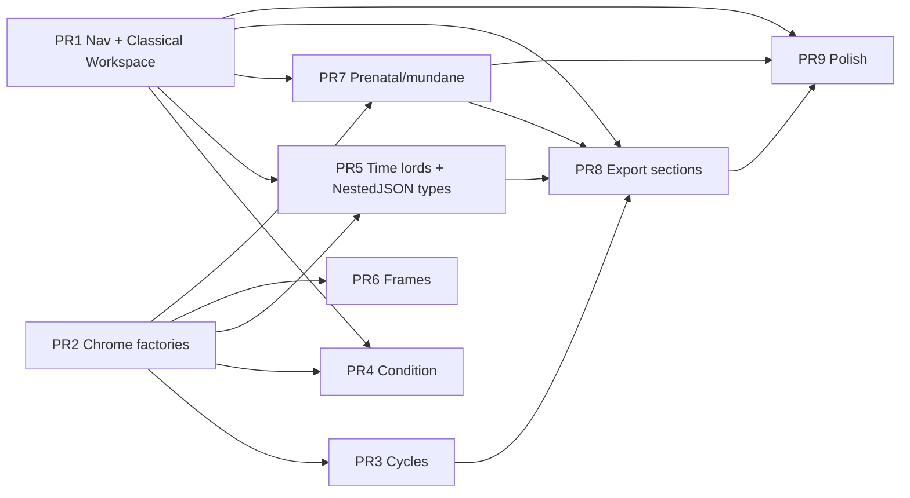

# TransitStudio UI 设计：B7–B20 扩展功能结果区与信息架构

| 字段 | 值 |
|------|-----|
| 文档标题 | UI Design — B7–B20 Expansion Modes & Classical 进阶 IA |
| 作者 | Design Agent（只读调研 + 设计稿） |
| 日期 | 2026-07-19 |
| 修订 | **2026-07-19 r4 — 用户确认决策写入**（古典进阶列表 IA、Workspace、导出合并+章节选择、深链 Q3） |
| 状态 | **Confirmed（用户已拍板）** |
| 范围 | 前端/UI 设计；**不改算法、不新增计算 mode 字符串** |
| 代码基线 | `Sources/TransitStudio/`（`AppNavigationRail`、`ModernResultModels`、`ContentView+RunActions`/`+ResultsPanes`/`+SidebarSections`/`+AIPanel`、B 系 `*Views`） |
| 视觉基线 | Celestial Almanac / Deep Space Night + `docs/frontend-refactor/09-visual-design-spec.md` |
| 平台 | macOS 13+ |

---

## 用户确认决策登记（r4 · 真源）

> 本节覆盖此前 Draft 默认。实现与评审以本节为准。

### 问题诊断对应决议

| ID | 用户决议 | 落地 |
|----|----------|------|
| **D1 / KD1** | 现代轨**只保留现代占星技法**；全部古典扩展技法迁入古典轨。新增与「行运 / 星图」同级的分组标题 **「古典进阶」**（与 Horary、窗口扫描同级语义的**分组标题**），其下以**列表**呈现进阶技法。 | 见 §1；**不做**多包折叠（classicalCondition/TimeLords…）；**不做**单一 Picker 实验室 |
| **D2 / KD2** | 引入 **Classical Workspace**，先试用，有问题再改 | §1.5；PR1 阻塞含五门闩 |
| **D3 / KD3** | 按设计改法；用户授权 agent 拍板细节 | **KD3 = A**：本命设置强制 `natalChart`；`→ modern` 时 `clampModernSubMode` 古典八键 → `.natal`；结果内存可保留但不自动展示 orphan |
| **D4** | 保证**基本结构化呈现** | 中文表头、EmptyState、MethodChrome、Overview 嵌 default tab；NestedJSON 主 UI 禁止纯 dump（配合 KD7=A） |
| **D5 / KD11** | 图标有**可感知差异** | 沿用 §1.3 唯一图标表；禁 B13–B20 共用 `star` |
| **D6 / KD9** | 古典进阶可**合并输出**，且必须有 **Markdown 章节选择** | §2.3：当前 mode 章节多选 + 「已计算的古典进阶合并导出」树形章节 |

### Key Decisions / Open Questions 拍板表

| ID | 用户选择 | 解释 / agent 补全 |
|----|----------|-------------------|
| KD1 | **= D1**（非旧稿「扩展实验室 Picker」） | 见上：古典进阶分组 + 列表；现代轨过滤掉古典八键 |
| KD2 | **A** | 完整 Workspace + 五门闩 |
| KD3 | 授权 agent | **A**（clamp + 清 workspace） |
| KD4 | **A** | 古典 expansion 冻结 8 键；B7/B8/B10/B12/B15/B19 仅现代 |
| KD5 | **A** | 扩展无 AI；`aiPanelContext = nil` |
| KD6 | 授权 agent | **A**：`ExpansionChromeModel` per-mode 工厂，不用 assumptions 正则 |
| KD7 | **A** | typed NestedJSON + 结构化 UI（B14/B16/B17/B18） |
| KD8 | **A** | B20 禁止吉凶推荐/排序 UX |
| KD9 | **A** + D6 | sectionId 真源 + 合并导出 |
| KD10 | **A** | PR1 含路由；PR4/5/7 依赖 PR1 |
| KD11 | 同意默认 | 唯一图标表 |
| KD12 | **同意**（原文「统一」按同意理解） | 吠陀与后端算法冻结；仅允许已有 JSON 字段的 typed decode |
| Q1 | **A** | §1.5.4 状态表 |
| Q2 | **A** | methodFamilies 仅现代 |
| Q3 | **C** | 做 2 条深链，见 §1.6 |
| Q4 | **A** | Overview 嵌 default tab，非独立 tab |
| Q5 | **A** | 自定义折叠/分组行（古典进阶用 `groupLabel` 样式，与「星图」「行运」一致） |
| Q6 | **A** | 不新增 streamKey |

### 明确否决 / 不再采用的 Draft 内容

- 古典轨再拆 `classicalCondition` / `classicalTimeLords` / `classicalPrenatal` / `classicalMundane` **多包**（改为单一「古典进阶」列表）。
- Alternative E（扩展只挂现代标签）作为最终态。
- 仅改导航、不改五门闩的 PR1。

---

## Overview

B7–B20 已交付后端与薄 Swift 壳，但 UI 缺口明显：现代轨平铺含古典在内的 **28** 个 `ModernSubMode`；古典轨只有本命/Horary/矫正；扩展结果区多为英文裸表；Classical 实践下五道硬门闩忽略 `modernSubMode`。

**用户确认后的四层解法：**

1. **信息架构（D1）**：现代轨 = 仅现代技法；古典轨 = 本命/Horary/矫正 + **「古典进阶」分组列表**（8 个 expansion）；行运（时间点/窗口扫描）两轨共用。
2. **Classical Workspace（D2/KD2）**：`natalChart | expansion(m)` + 改写 Run / Results / Sidebar / Run chrome / AI。
3. **基本结构化结果区（D4）**：中文表头、EmptyState、MethodChrome 工厂、嵌顶 Overview；NestedJSON typed（KD7）。
4. **导出（D6）**：古典进阶支持**当前 mode 章节选择**与**多 mode 合并 Markdown**（章节树）。
5. **深链（Q3-C）**：古典本命结果 → 古典进阶 2 条入口。
6. **分期 PR**：PR1 = 导航 + Workspace 路由（阻塞）。

---

## Background & Motivation

### 当前 UI 壳（已部分重设计 2026-07）

| 区域 | 文件 | 现状 |
|------|------|------|
| 设计令牌 | `DesignTokens.swift` | 羊皮纸浅色 + Deep Space 深色；`TS.Spacing` / `TS.Font` / `TS.SemanticColor` |
| 顶栏 | `ContentView+TopBar.swift` | 档案胶囊 / 实践模式 / 运行按钮 |
| 左轨 | `AppNavigationRail.swift` | 现代 = flat 全部 `ModernSubMode`；古典 = 3 项 |
| 参数抽屉 | `ContentView+Sidebar*` | B 系在 `modernSettingsSidebar` |
| 结果工具条 | `ResultToolbarViews.swift` | `ResultPaneToolbar`；古典有 section 导出 sheet |
| AI | `ContentView+AIPanel.swift` | 现代 B 系已 `nil` |
| 视觉模板 | `docs/frontend-refactor/09-visual-design-spec.md` | InfoCard / Table / EmptyState |

### 导航与门闩痛点（代码核实，仍成立）

- 现代 flat 28 项；古典 3 项；B9/B11–B20 错挂现代。
- B13–B20 图标共用 `"star"`。
- Classical 下 Run/Results/Sidebar/Title/AI **硬门闩**只走本命——只写 `modernSubMode` 会假通。
- 结果区薄壳；NestedJSON 未结构化；导出缺章节选择（相对古典本命）。

### 产品约束（必须保留）

- Result-Pane Tab Contract（`resultTabTitle` + 每 id 有 case）。
- AI Streaming Contract；本轮扩展 **不** 新增 streamKey。
- Markdown 一等；`method_key` / `method_profile` 显式。
- 吠陀回归 only；中文文案风格对齐现有。

---

## Goals & Non-Goals

### Goals

1. **古典进阶 IA**：古典轨增加与「星图 / 行运」同级的 **「古典进阶」** 分组标题，下列 8 个技法；现代轨**剔除**这 8 键，仅保留现代技法。
2. **Classical Workspace** + 五门闩改写（可试用迭代）。
3. 基本结构化结果区：侧栏、tabs、嵌顶 Overview、中文表、空/错/诊断、MethodChrome。
4. NestedJSON 字段图 + typed struct（B14/B16/B17/B18）。
5. 古典进阶 Markdown：**章节选择** + **多 mode 合并导出**。
6. 2 条古典本命 → 进阶深链（Q3-C）。
7. 可分期 PR；PR1 含路由。

### Non-Goals

- 不改 Python 算法、不新增后端 `mode` 字符串。
- 不重做吠陀；不引入地图/星盘新算法。
- 不为扩展新增 AI（`aiPanelContext == nil`）。
- 不做「最近计算」栈 UI。
- 不把现代周期（赤纬/逆行/会合等）塞进古典进阶。

---

## Proposed Design

### 1. 信息架构（用户确认：古典进阶列表）

#### 1.1 原则

| # | 原则 | 落地 |
|---|------|------|
| P1 | 现代轨 = 现代技法 only | `ModernSubMode` 去掉 `ClassicalExpansionSubModes` |
| P2 | 古典扩展全部进 **古典进阶** 列表 | 与 Horary / 窗口扫描同级的是**分组标题**，不是再开 4 个包 |
| P3 | 后端 mode 键不变 | 仍用 `ModernSubMode.rawValue` + 现有 `run*` |
| P4 | 古典扩展必须走 **Workspace** | §1.5；不能只写 `modernSubMode` |
| P5 | 行运区跨实践模式共用 | 时间点 / 窗口扫描 |
| P6 | 图标可区分 | §1.3 |

#### 1.2 左轨结构（古典 · 确认稿）

与现有 `groupLabel("星图")` / `groupLabel("行运")` 同一模式：

```
┌ 收起 ─────────────────┐
│ 星图                  │  ← groupLabel
│   本命设置            │
│   Horary              │
│   生时矫正            │
│ 古典进阶              │  ← groupLabel（与「行运」同级）
│   可见相位/行星时     │  ← 列表叶子
│   希腊状态审计        │
│   派生盘/尊贵         │
│   时间主扩展          │
│   主限审计            │
│   沿界/主限扩展       │
│   产前朔望/Parans     │
│   世俗/择时事实       │
│ 行运                  │  ← groupLabel
│   时间点              │
│   窗口扫描            │
│ 程序设置              │
└───────────────────────┘
```

**现代轨**：过滤后的现代技法列表（本命/合盘/…/赤纬/逆行/会合/Draconic/方法族/轨道点/地理…）。**不得**再出现上述 8 个古典进阶叶子。现代轨是否再分子组（核心盘/推运/地理）为 **P2 可选打磨**，非 PR1 阻塞；PR1 最小交付 = 过滤 flat 列表即可。

#### 1.3 成员冻结与图标

**ClassicalExpansionSubModes（古典进阶列表 · 冻结 8）**

| Mode | 中文 title | 设计 icon（唯一） |
|------|------------|-------------------|
| `classicalVisibility` | 可见相位/行星时 | `eye`（可保持） |
| `hellenisticConditionAudit` | 希腊状态审计 | `list.bullet.rectangle` |
| `classicalDerivatives` | 派生盘/尊贵 | `square.split.2x1` |
| `timeLordsExtended` | 时间主扩展 | `hourglass` |
| `primaryDirectionsAudit` | 主限审计 | `arrow.up.right.circle` |
| `distributionsPd` | 沿界/主限扩展 | `rectangle.split.3x1` |
| `prenatalParans` | 产前朔望/Parans | `sparkles` |
| `mundaneElectional` | 世俗/择时事实 | `building.columns` |

**仅现代（不得进古典进阶）**：natal、关系盘、推运/返照/中点、地理、`modernCycles`、`declinationTiming`、`retrogradeCycles`、`planetarySynodic`、`draconicHeliocentric`、`methodFamilies`、`orbitalDial` 等。

**图标规则（D5）**

- 禁止 8 键回落同一 `star`。
- `orbitalDial` → `circle.dotted`（**禁止**与 midpoint 的 `circle.grid.cross` 撞车）。
- macOS 13 缺失时回退：`circle.dotted`→`dot.circle`；实现时目标系统目视。

#### 1.4 导航数据模型（实现提示）

```swift
// 可放 NavigationPackages.swift 或 OptionModels 旁
static let classicalExpansionSubModes: [ModernSubMode] = [
  .classicalVisibility, .hellenisticConditionAudit, .classicalDerivatives,
  .timeLordsExtended, .primaryDirectionsAudit, .distributionsPd,
  .prenatalParans, .mundaneElectional
]

static var modernRailSubModes: [ModernSubMode] {
  ModernSubMode.allCases.filter { !classicalExpansionSubModes.contains($0) }
}
```

- 古典进阶叶子点击：`onSelectClassicalExpansion(m)` → Workspace `.expansion(m)` + `modernSubMode=m`。
- 本命设置：`onSelectClassicalNatal` → Workspace `.natalChart`。
- 现代叶子：现有 `modernNavButton`；数据源改为 `modernRailSubModes`。

#### 1.5 Classical Workspace 状态机（阻塞 · KD2=A · 用户确认试用）

##### 1.5.1 状态定义

```swift
enum ClassicalSettingsWorkspace: Equatable {
    case natalChart
    case expansion(ModernSubMode)  // m ∈ classicalExpansionSubModes
}
// ContentView / AppState: classicalSettingsWorkspace = .natalChart
```

| 用户点选 | 写入 | rail 高亮 |
|----------|------|-----------|
| 本命设置 | `mode=.settings`；`workspace=.natalChart` | classical ∧ settings ∧ natal |
| 古典进阶叶子 m | `mode=.settings`；`workspace=.expansion(m)`；`modernSubMode=m`；关 settings page | expansion==m |
| Horary / 矫正 / 时间点 / 扫描 | 现有 `CalculationMode` | 对应 mode |

**不变量**

1. 「本命设置」**强制** `.natalChart`；gates **只认 workspace**，忽略残留 `modernSubMode`。
2. 扩展点选双写 `modernSubMode`，触发既有 `resetModernSelectedTab`。
3. 现代实践 **不读** workspace。

##### 1.5.2 门闩改写（文件级 · PR1 必做）

| 门闩 | 文件 | 行为 |
|------|------|------|
| Run | `ContentView+RunActions.runCurrentMode` | classical+settings：natal→`runClassical()`；expansion(m)→与 modern 相同的 `run*(m)` |
| Results | `ContentView+ResultsPanes` | natal→`classicalResultsPane`；expansion→对应 `*ResultsPane`（读 `modernResultData`） |
| Sidebar | `ContentView+SidebarSections` | natal→`classicalSettingsSection`；expansion→抽取 `sidebar(for: m)` 与 modern 共用 |
| Run chrome | `runButtonTitle` / `runDisabled` / Help | expansion 复用 modern 同 m 文案与校验 |
| AI | `ContentView+AIPanel` | natal→现有 classical；**expansion→`nil`**；禁止复用 `streamKey: "classical"` |

扩展结果 **写入** `modernResultData`，**不**写入 `classicalResult`。

##### 1.5.3 实践模式切换（Q1=A · KD3=A）

```text
ClassicalExpansionSubModes = 上表 8 键
func clampModernSubMode(_ m) -> m ∈ 八键 ? .natal : m
```

| 从 → 到 | 规则 |
|---------|------|
| any → **modern** | `modernSubMode = clamp(...)`；结果内存保留；UI 按 clamp 后叶子高亮 |
| any → **classical** | `workspace = .natalChart`（安全默认） |
| any → **vedic** | clamp modernSubMode |
| classical horary/rectify → modern | mode→`.settings` + natal |
| 不做 | 「最近计算」入口；切回古典后需再点进阶项才看扩展结果 |

##### 1.5.4 序列图（古典进阶）

```mermaid
sequenceDiagram
  participant User
  participant Rail
  participant CV as ContentView
  participant Run
  participant Pane
  User->>Rail: 古典进阶 · 希腊状态审计
  Rail->>CV: workspace=expansion(hellenistic); modernSubMode=…
  User->>CV: 运行
  CV->>Run: runHellenistic…
  Run->>Pane: modernResultData → Audit pane
```

#### 1.6 深链（Q3=C · 确认 2 条）

在**古典本命结果区**增加跳转到古典进阶的入口（按钮或行尾 link），实现时：`workspace=.expansion(m)` + `modernSubMode=m` + `mode=.settings`（必要时提示用户去参数抽屉补 reference 等）。

| # | 从（古典本命 UI） | 到（古典进阶） | 说明 |
|---|-------------------|----------------|------|
| DL1 | 结果 tab **主限**（`primary`）工具条/空态旁 | `primaryDirectionsAudit` | 「打开主限审计（进阶）」— 对照 B16 算法边界 |
| DL2 | 结果 **时机** tab 内产前朔望卡片 / 区块 | `prenatalParans` | 「打开产前朔望/Parans 包」— 完整 packet + 恒星代理 |

非目标：本轮不做时间主/ZR 深链（可后续加 `timeLordsExtended`）。

---

### 2. 共享 UI 模式

骨架：

```text
VStack {
  ResultPaneToolbar(tabs, moreTabs, export…)
  MethodChromeBanner(chrome: ExpansionChromeModel)  // 工厂产出，非临时拼装
  // optional FilterBar
  selectedResultView
}
.padding(TS.Padding.resultContent)
```

#### 2.1 `ExpansionChromeModel` + `MethodChromeBanner`

**禁止**以 assumptions 字符串 regex（`proxy|not full`）作为唯一代理检测。

```swift
struct ExpansionChromeModel {
    var title: String
    var methodLine: String?          // meta.method / algorithmName
    var profileChips: [String]       // ≤3 method_key/profile + overflow
    var badge: ExpansionBadge?       // .audit / .proxy / .factMatrix / .multiProfile
    var detailCaption: String?       // 一行边界说明
    var configSummary: [(String, String)]  // requested vs effective 等
}

enum ExpansionBadge: String {
    case audit           // 审计
    case auditLocalOnly  // 审计 · 本地一致
    case proxy           // 代理
    case factMatrix      // 事实矩阵
    case multiProfile    // 多 profile
}
```

**Per-mode chrome 工厂表**

| Mode | meta 字段 | 扫描的行字段 | badge | detailCaption 来源 |
|------|-----------|--------------|-------|-------------------|
| declinationTiming | method, oobThresholdMethod | events[].methodKey | — | OOB 阈值方法文案 |
| retrogradeCycles | method | cycles/stations methodKey | — | 侧栏同款阴影定义一句 |
| classicalVisibility | method | heliacal/riseSet/hours methodKey | — | — |
| planetarySynodic | method | events/cycles methodKey | — | — |
| hellenisticConditionAudit | method | conditions[].methodKey | **audit** | 固定：「条件证据，不做综合打分」 |
| draconicHeliocentric | method | planets coordinateSystem | — | 北交平移定义一句 |
| classicalDerivatives | method | dodeka/monomoiria/topical methodKey | monomoiria 行含 proxy key → **proxy** chip | monomoiria method_key 展示 |
| timeLordsExtended | method, age, fortune/spirit lon | daily.methodKey；ZR `_method` | daily → **proxy** | daily note |
| methodFamilies | method | profileId 列表 | armc_361 → **proxy** | 「多 profile 对照」 |
| primaryDirectionsAudit | algorithmName, method | directions methodKey；**algorithmDescription** 见 §3.3 | **auditLocalOnly** when external_crosscheck_status == local_se_consistent_only | known_limits 首条或 note |
| distributionsPd | method, baselineAlgorithm | distributions.methodKey；pd methodProfile | **multiProfile** | requires_b16 提示 |
| prenatalParans | method, paranCount | parans.methodKey；packet method | parans → **proxy** | 「RA 共中天代理」 |
| orbitalDial | method | points/pictures methodKey | — | 行星交点≠月交点 |
| mundaneElectional | method | ingress/candidate | **factMatrix** | 「不排序吉时」 |

UI：serif 标题 + gold chip + warning 色 badge。

#### 2.2 Overview / Assumptions / EmptyState / 中文表头

同前稿：InfoCard ≤6；`AssumptionsListView`；`EmptyStateView` 规范；中英列表头映射。
**InfoCard** 现位于 `VedicResultViews.swift`：PR2 可 (a) 原样复用或 (b) 下沉到 `ResultUtilityViews.swift`——推荐 (b) 避免跨域文件依赖，但非阻塞。

#### 2.3 导出 section picker + 古典进阶合并导出（D6 / KD9）

古典本命现用 `ContentView+ClassicalPane` 的 sheet（`showClassicalExportSheet`）。古典进阶（D6）：

1. **当前进阶 mode**：泛化 `markdownSectionPicker`；按 mode 的 `sectionId` 多选导出（下表）。
2. **合并导出（必须支持）**：当用户已计算过多个古典进阶结果时，提供「导出古典进阶（合并）」——单一 Markdown，结构为：

```markdown
# 古典进阶合并导出
## 可见相位/行星时
### 偕日升降
…
## 希腊状态审计
### 条件证据
…
```

   - Sheet UI：**两级**选择——mode 开/关 + 其下 section 多选；仅列出**当前会话已有结果**的 mode（`modernResultData` 历史若只保留最新一个 case，则需 **扩展结果缓存** ` [ModernSubMode: AnyResult]` 或等价字典——PR1/PR8 二选一：
     - **推荐 PR8**：引入 `classicalExpansionResults: [ModernSubMode: ExpansionStoredResult]`（计算成功时写入，不自动清空其它 mode）；合并导出读此字典。
     - 若只保留单一 `modernResultData`，合并导出仅能含**当前** mode（不满足 D6）——故 **D6 要求多结果缓存**。
3. Markdown 拼接：调用各 mode 既有 `MarkdownExportBuilder.*`，按勾选 section 过滤；不改计算。


**Per-mode section id 清单（PR8 单一真源）**

| Mode | sectionId | 中文标题 | Markdown 切片 |
|------|-----------|----------|---------------|
| declination_timing | `events` | 赤纬事件 | 事件表 |
| | `stations` | 赤纬停滞 | 过滤 station |
| | `oob` | OOB | entry/exit |
| | `assumptions` | 计算假设 | assumptions + OOB meta |
| | `warnings` | 警告 | warnings/section_errors |
| retrograde_cycles | `cycles` | 逆行周期 | |
| | `stations` | 站度 | |
| | `assumptions` | 计算假设 | |
| | `warnings` | 警告 | |
| planetary_synodic | `events` | 相位事件 | |
| | `cycles` | 会合周期 | |
| | `contacts` | 本命接触 | |
| | `assumptions` | 计算假设 | |
| | `warnings` | 警告 | |
| classical_visibility | `heliacal` | 偕日升降 | |
| | `rise_set` | 升落 | |
| | `hours` | 行星时 | |
| | `assumptions` | 计算假设 | |
| | `warnings` | 警告 | |
| hellenistic_condition_audit | `conditions` | 条件证据 | |
| | `assumptions` | 计算假设 | |
| | `warnings` | 警告 | |
| classical_derivatives | `dodeka` | 十二分盘 | |
| | `monomoiria` | 一度主 | |
| | `topical` | 主题 Almuten | |
| | `assumptions` | 计算假设 | |
| | `warnings` | 警告 | |
| time_lords_extended | `concordance` | 技法汇合 | |
| | `daily` | 日小限 | |
| | `zr` | ZR | |
| | `assumptions` | 计算假设 | |
| | `warnings` | 警告 | |
| method_families | `profiles` | 次限角点 | |
| | `solar_arc` | 太阳弧 | |
| | `assumptions` | 计算假设 | |
| | `warnings` | 警告 | |
| primary_directions_audit | `audit` | 主限表 | |
| | `algorithm` | 算法说明 | algorithm_description |
| | `assumptions` | 计算假设 | |
| | `warnings` | 警告 | |
| distributions_pd | `distributions` | 沿界 | |
| | `pd_profiles` | 主限多配置 | |
| | `assumptions` | 计算假设 | |
| | `warnings` | 警告 | |
| prenatal_parans | `packet` | 朔望包 | |
| | `parans` | Parans 代理 | |
| | `assumptions` | 计算假设 | |
| | `warnings` | 警告 | |
| orbital_dial | `dial` | 轨道点 | |
| | `pictures` | 行星图 | |
| | `assumptions` | 计算假设 | |
| | `warnings` | 警告 | |
| mundane_electional | `ingresses` | 入宫 | |
| | `candidates` | 择时事实 | |
| | `assumptions` | 计算假设 | |
| | `warnings` | 警告 | |
| draconic_heliocentric | `draconic` | Draconic | |
| | `heliocentric` | 日心 | |
| | `compare` | 对照 | |
| | `assumptions` | 计算假设 | |
| | `warnings` | 警告 | |

短结果 mode 可默认全选一键复制，不强制 sheet。

#### 2.4 诊断 tab

统一 `("diagnostics", "诊断")` + `ModernDiagnosticsView`。

---

### 3. NestedJSON 字段图（可实施）

`NestedJSON` 定义于 `DeclinationTimingModels.swift`（`object/array/string/number/bool/null`）。下列优先 **typed 解码**（推荐），避免 UI 内 ad-hoc 遍历；改 decode 须跑 `BackendContractTests` 并必要时刷新 fixture。

#### 3.1 B14 ZR — `TimeLordsExtendedResult.zodiacalReleasing: NestedJSON?`

Fixture 顶层键：`fortune`, `spirit`, `max_level`, `fortune_longitude`, `spirit_longitude`。

| JSON path | 类型 | UI |
|-----------|------|-----|
| `fortune_longitude` / `spirit_longitude`（根或 meta） | number | Overview / Grid |
| `max_level` | int | caption |
| `fortune` / `spirit` | object | 分段 |
| `*.current_active_level` | string L1–L4 | InfoCard |
| `*.current_level_ruler` / `current_level_sign` | string | Grid |
| `*.lot_longitude` / `lot_id` | number/string | Grid |
| `*.loosing_of_bond` | bool | LoB 标签（仅 true） |
| `*.loosing_of_bond_detail` / `level` | string | detail |
| `*.l1_periods[]` … `*.l4_periods[]` | array | Table / Timeline |
| `*.lN_periods[].level,sign,sign_index,ruler,years,start_local,end_local,is_active` | 见左 | 列：层/星座/主星/年数/起止/当前 |

推荐 struct：

```swift
struct ZRLotBlock: Codable {
    var currentActiveLevel: String?
    var currentLevelRuler: String?
    var currentLevelSign: String?
    var lotLongitude: Double?
    var lotId: String?
    var loosingOfBond: Bool?
    var loosingOfBondDetail: String?
    var loosingOfBondLevel: String?
    var l1Periods: [ZRPeriodRow]?
    var l2Periods: [ZRPeriodRow]?
    var l3Periods: [ZRPeriodRow]?
    var l4Periods: [ZRPeriodRow]?
    // CodingKeys snake_case
}
struct ZRPeriodRow: Codable, Identifiable {
    var level, sign, ruler: String?
    var signIndex: Int?
    var years: Double?  // 或 LooseNumber
    var startLocal, endLocal: String?
    var isActive: Bool?
    var id: String { "\(level ?? "")-\(sign ?? "")-\(startLocal ?? "")" }
}
struct ZodiacalReleasingPayload: Codable {
    var fortune: ZRLotBlock?
    var spirit: ZRLotBlock?
    var maxLevel: Int?
    var fortuneLongitude: Double?
    var spiritLongitude: Double?
}
```

解码策略：`TimeLordsExtendedResult` 增加 `var zrPayload: ZodiacalReleasingPayload?` 计算属性——对 `zodiacalReleasing` 再 encode/decode，失败则 EmptyState「ZR 结构无法解析」+ json tab。
**禁止** monospaced 整包 JSON 作主 UI。

#### 3.2 B18 prenatal packet — `prenatalPacket: NestedJSON?`

| JSON path | UI |
|-----------|-----|
| `prenatal_syzygy.syzygy_type` | 类型 |
| `prenatal_syzygy.exact_utc` / `exact_jd` | 时间 |
| `prenatal_syzygy.longitude` / `sign` / `degree` | 位置 |
| `prenatal_syzygy.sun_position` / `moon_position` | 日月位置（全文或 lon） |
| `prenatal_syzygy.syzygy_degree_used` | **必须展示**（Sun/Moon/轴约定） |
| `prenatal_syzygy.ruler` / `method_variant` | 主星/方法 |
| `syzygy_chart.planets[]` | 可选缩略表 name/longitude |
| `syzygy_chart.angles` / `houses` / `house_system` / `method_key` | 次要 |

推荐 `PrenatalPacketSummary` typed struct；主 tab 模板 C/E。

#### 3.3 B16 algorithm_description — `algorithmDescription: NestedJSON?`

| JSON path | UI |
|-----------|-----|
| `name` | Chrome methodLine / assumptions 顶 |
| `key` | chip |
| `known_limits[]` | 列表（算法说明 section / assumptions） |
| `external_crosscheck_status` | badge：`local_se_consistent_only` → 审计·本地一致 |
| `external_crosscheck_note` | 可展开说明 |

推荐 `PDAlgorithmDescription: Codable`。**不要**只靠 assumptions 文本。

#### 3.4 B17 distribution `packet` — `DistributionPacketRow.packet: NestedJSON?`

| JSON path | UI（distributions 主表升级） |
|-----------|------------------------------|
| `current_ruler` / `current_ruler_id` | 列或详情 |
| `current_bound_info` | 列「当前界」 |
| `bound_sign` / `bound_start_degree` / `bound_end_degree` | 界范围 |
| `bound_start_date` / `bound_end_date` | 日期 |
| `current_directed_position` / `start_lon` | 黄经 |
| `system` / `naibod_rate` | caption |
| `boundaries[]` | 子表或 disclosure |
| `boundaries[].sign,start_degree,end_degree,ruler,arc_value,age_at_boundary,estimated_date,is_current` | 沿界序列 |

推荐 `CircumambulationPacket: Codable` + `BoundBoundaryRow`。
**成熟度**：外层四列 + chrome = L1；展开 packet 当前界 + boundaries = **L3 完成定义**。未 typed 前不得宣称 L3 done。

---

### 4. Per-mode UI 规格（摘要 + 修订点）

成熟度 L1–L4 同前。Overview **嵌入 default tab 顶部**（不改 `defaultResultTab`）。

#### 包 A — 现代周期

**B7 declination_timing** — L3–L4；tabs `events|stations|oob|assumptions`；列：本地/次序/行运点/事件/目标/赤纬°/精确差（对齐 `DeclinationTimingEvent`）。侧栏 Toggle 中文映射 raw API。

**B8 retrograde_cycles** — L3；tabs `cycles|stations|assumptions`。

**B10 planetary_synodic** — L3；tabs `events|cycles|contacts|assumptions`。

#### 包 B — 古典状态

**B9 classical_visibility** — 古典轨；tabs 中文「偕日升降/升落/行星时」。

**B11 hellenistic_condition_audit** — badge 审计；列：主体/条件 ID/几何/容许度/**method_key**（模型已有 `HellenisticConditionRow.methodKey`，视图须补列）；空态禁止「选择标签页」。

**B13 classical_derivatives** — dodeka/monomoiria/topical；monomoiria 代理 badge。

#### 包 C — 古典时间主

**B14** — ZR 用 §3.1；concordance 表保持；daily 模板 C + proxy。

**B16** — 主表 typed 列；algorithm §3.3。

**B17** — pd_profiles 列清晰；distributions 须 §3.4 才算 L3。

#### 包 D — 特殊坐标 / 方法室

**B12 / B15 / B19** — 空态、CollapsibleSection profiles、orbitalDial 用 `circle.dotted`。

#### 包 E — 产前 / 世俗

**B18** — packet §3.2；parans 代理 badge。

**B20** — 事实矩阵；**禁止 UX 清单**：

- 无「得分/分数」列
- 无「推荐」badge
- 无绿/红吉凶着色
- 无默认排序标签「最佳/吉时」
- 允许按主题宫相关字段排序，但文案只能是中性「按时间」「按 ASC」等

侧栏已有「仅输出事实矩阵，不排序吉时」——保留。

#### 每 pane PR 检查清单（Tab 契约）

- [ ] tabs/moreTabs 列表为唯一标题源；`resultTabTitle` 非空
- [ ] `switch` 穷尽（含 diagnostics/json）
- [ ] 未改 `defaultResultTab` 除非同步测试
- [ ] 空表 EmptyState
- [ ] MethodChrome 工厂接入
- [ ] 中文表头

---

### 5. 视觉一致性

- Token 与模板 A/B/C/D/E 同前。
- 组件：`ResultPaneToolbar`、`EmptyStateView`、`ModernDiagnosticsView`、`CollapsibleSection`、`InfoCard`（迁移可选）、新建 chrome/assumptions。
- 深色模式仅用 `TS.SemanticColor.*`。

---

## API / Interface Changes

### 后端

无 mode/schema 算法变更。Typed decode 只映射 **已有** JSON 键。

### Swift 状态 / 路由（PR1 必做）

| 项 | 说明 |
|----|------|
| `ClassicalSettingsWorkspace` | 新建 enum；`ContentView` 或 `AppState` 持有 |
| `AppNavigationRail` | 包折叠；古典扩展回调 `onSelectClassicalExpansion(m)` / `onSelectClassicalNatal` |
| `ContentView+RunActions` | classical 分支按 workspace 分发 |
| `ContentView+ResultsPanes` | classical results 按 workspace 分发；title/disabled 分发 |
| `ContentView+SidebarSections` | classical sidebar 按 workspace 分发；抽取 `sidebar(for: ModernSubMode)` |
| `ContentView+AIPanel` | expansion → `nil` |
| `practiceModeBinding` | §1.5.4 状态表 |
| `ModernSubMode.icon` | 唯一化叶子图标 |
| `NavigationPackages.swift` | 包定义 |

### 结果组件（PR2+）

`ExpansionChromeModel` 工厂、`MethodChromeBanner`、`AssumptionsListView`、可选 typed ZR/Packet/PD/Distrib models、`markdownSectionPicker` 泛化。

---

## Data Model Changes

| 变更 | 契约影响 |
|------|----------|
| 可选 typed structs 覆盖 NestedJSON | 须 `BackendContractTests` 绿；fixture 已含字段则通常无需重生成 |
| `classicalSettingsWorkspace` | 仅 UI 状态；可不持久化（默认 natal） |
| 包展开 UserDefaults | 可选 P2 |

---

## Alternatives Considered

### A — 仅 flat list 润色
否决：违背 §2.5，古典不可达。

### B — 每技法独立 `CalculationMode`
否决：路由爆炸。

### C — 多包折叠 + Workspace
**部分否决（IA）**：用户改为 **单一「古典进阶」列表**；Workspace 部分仍采纳。

### D' — 古典进阶分组列表 + Workspace（**采纳 · 用户 D1**）
与「星图/行运」同级 `groupLabel("古典进阶")`，下列表叶子；可发现性优于 Picker；实现简单于多包。

### E — 现代轨「古典技法」标签包、**不**改 classical 门闩（安全过渡）

| | |
|--|--|
| 做法 | 仅在现代轨增加分组「古典状态/时间主/…」；古典轨仍 3 项 |
| 优点 | 零 hard-gate 风险；PR 可极小 |
| 缺点 | IA 仍错（古典用户要切现代）；与产品「古典轨安置」目标不符 |
| 结论 | **否决为最终态**；若人力极度受限可作 **PR0 仅分组** 并行，但 **不得**替代 PR1 Workspace。本设计默认直接做 C。 |

---

## Security & Privacy

本机计算；导出含出生数据；不碰 LLM Key 存储决策；审计徽章降低方法误解（产品诚实性）。

---

## Observability

诊断 tab；无新 telemetry；PR 验收：古典扩展选→标题变→sidebar 变→run 写 modernResultData→结果 pane 对→AI 不可用。

---

## Rollout Plan

| 阶段 | 内容 |
|------|------|
| 0 | 设计评审（本文 r2） |
| 1 | **PR1：古典进阶列表 + Workspace 五门闩 + 过滤现代轨 + clamp + 图标 + AI nil** |
| 2 | PR2 共享 chrome |
| 3–7 | 各包 pane |
| 8 | 导出 section id |
| 9 | 打磨回归 |

回滚：PR1 可整分支回退；gates 改动集中，禁止只合导航不合路由。

---

## Open Questions（已全部关闭 · r4）

| ID | 决议 | 说明 |
|----|------|------|
| Q1 | **A** | 实践切换 §1.5.3 |
| Q2 | **A** | methodFamilies 仅现代 |
| Q3 | **C** | DL1 主限→主限审计；DL2 产前朔望→prenatal_parans |
| Q4 | **A** | Overview 嵌 default tab |
| Q5 | **A** | 古典进阶用 `groupLabel` + 列表；不用 DisclosureGroup 多包 |
| Q6 | **A** | 扩展无 AI |

无遗留 needs-user-input。

---

## Key Decisions（用户确认 · r4）

1. **古典进阶列表 IA（D1/KD1）**：现代轨过滤古典八键；古典轨 `groupLabel("古典进阶")` + 8 叶子列表；非多包、非实验室 Picker。
2. **Classical Workspace + 五门闩（KD2=A）**：先落地试用。
3. **本命清除 expansion + clamp（KD3=A）**：agent 代决。
4. **八键冻结（KD4=A）**；B7/B8/B10/B12/B15/B19 仅现代。
5. **扩展 AI = nil（KD5=A）**。
6. **MethodChrome 工厂（KD6=A）**：agent 代决；禁用 assumptions 正则作为唯一代理检测。
7. **NestedJSON typed（KD7=A）** + 基本结构化呈现（D4）。
8. **B20 事实矩阵 only（KD8=A）**。
9. **导出章节选择 + 合并导出 + 多结果缓存（KD9=A + D6）**。
10. **PR1 含路由（KD10=A）**。
11. **图标唯一（KD11）**。
12. **吠陀/算法冻结（KD12）**；允许既有字段 typed decode。
13. **深链 2 条（Q3-C）** 见 §1.6。

---

## Risks

| 风险 | 严重度 | 缓解 |
|------|--------|------|
| PR1 漏改某一门闩 | 高 | 验收清单五路径；code review 对照 §1.5.2 |
| workspace 与 modernSubMode 不同步 | 中 | 扩展点选强制双写；natal 只清 workspace |
| NestedJSON 解码失败 | 中 | 失败 EmptyState + json tab；合同测试 |
| 实践切换强制 natal 丢失扩展高亮 | 低 | 文档预期；结果内存仍在 |
| SF Symbol 在 macOS 13 缺失 | 低 | 回退表 |

---

## References

- `AppNavigationRail.swift`, `ModernResultModels.swift`（28 cases）
- `ContentView+RunActions.swift`, `+ResultsPanes.swift`, `+SidebarSections.swift`, `+AIPanel.swift`, `+ClassicalPane.swift`, `+ModernPanes.swift`, `+TopBar.swift`
- `NestedJSON` in `DeclinationTimingModels.swift`
- Fixtures: `SwiftTests/Fixtures/{time-lords-extended,prenatal-parans,primary-directions-audit,distributions-pd}-result.json`
- B 系 Views/Models/Exports；`ResultToolbarViews.swift`；`DesignTokens.swift`；`VedicResultViews.swift`（InfoCard）
- `docs/frontend-refactor/09-visual-design-spec.md`；roadmap after-b6；b13–b20 handoff；`AGENTS.md`

---

## PR Plan

### PR1 — 古典进阶导航 + Classical Workspace 路由（阻塞）

- **标题**：`ui: classical advanced list + workspace routing`
- **影响文件**：
  - `AppNavigationRail.swift`（现代过滤；古典 `groupLabel("古典进阶")` + 8 列表）
  - 可选 `NavigationPackages.swift` / 常量列表
  - `ContentView.swift` / `AppState.swift`（`classicalSettingsWorkspace`）
  - **`ContentView+RunActions.swift`**
  - **`ContentView+ResultsPanes.swift`**
  - **`ContentView+SidebarSections.swift`**
  - **`ContentView+AIPanel.swift`**
  - `ContentView+TopBar.swift`（practice 切换 §1.5.3）
  - `ModernResultModels.swift`（icons；可选 rail 过滤 helper）
  - `CHANGELOG.md`、`PLANS.md`
- **依赖**：无
- **描述**：**古典进阶列表 IA**；**workspace + 五门闩**；clamp；AI nil；图标差异化。结果区 polish / 深链 / 合并导出 **不**在此 PR（深链→PR4/7 或 PR9；合并导出→PR8）。
- **验收清单（PR1 必须全绿）**：
  1. 现代轨 **无** 八个古典进阶叶子。
  2. 古典轨有 **古典进阶** 分组 + 8 项列表。
  3. 古典 natal：run/results/sidebar/title/AI = 本命路径。
  4. 古典进阶 B11：title≠「古典排盘」；sidebar 扩展；run→`modernResultData`；results 扩展 pane；AI nil。
  5. 本命设置强制清除 expansion workspace。
  6. classical expansion → modern：clamp → `.natal`；无 orphan 标题。
  7. horary/rectify → modern：settings + natal。
  8. modern → classical：workspace=natalChart。
  9. 图标：八键无共用 star；orbitalDial ≠ midpoint。

### PR2 — 共享 chrome / assumptions / 列工具

- **标题**：`ui: expansion method chrome factories`
- **文件**：新建 chrome 组件；可选 InfoCard 迁入 `ResultUtilityViews.swift`；`ExpansionUICopy`
- **依赖**：无（建议 PR1 后）
- **描述**：`ExpansionChromeModel` 工厂表；AssumptionsListView；中文列 helper。

### PR3 — 现代周期 pane（B7/B8/B10）

- **依赖**：PR2
- **文件**：Declination/Retrograde/Synodic Views + sidebar 文案

### PR4 — 古典进阶状态类 pane（B9/B11/B13）+ 可选 DL 占位

- **依赖**：**PR1** + PR2
- **文件**：Visibility/Hellenistic/Derivatives Views
- **描述**：基本结构化（中文表头/EmptyState/Chrome/Overview）。深链按钮可在 PR9 与 DL 一并合入。

### PR5 — 古典时间主 pane（B14/B16/B17）

- **依赖**：**PR1** + PR2
- **文件**：TimeLords/PrimaryDirections/Distributions Views + **typed NestedJSON models**（§3.1–3.4）
- **描述**：ZR/packet/algorithm/boundaries 结构化 UI。

### PR6 — 特殊坐标与方法室（B12/B15/B19）

- **依赖**：PR2（现代轨，不强制 PR1 classical）
- **文件**：Draconic/MethodFamilies/OrbitalDial Views

### PR7 — 产前与世俗（B18/B20）

- **依赖**：**PR1** + PR2
- **文件**：PrenatalParans（packet typed）/ MundaneElectional；B20 禁止 UX 清单
- **描述**：含 DL2 目标页体验；深链入口可在古典 timing 视图加按钮（或 PR9）。

### PR8 — Markdown 章节选择 + 古典进阶合并导出

- **依赖**：PR1 + 至少 2 个古典进阶 pane 可算
- **文件**：结果缓存字典；`ResultToolbarViews`；Exports；合并导出 sheet
- **描述**：§2.3 — 当前 mode section 多选 + 多 mode 合并树；**必须**多结果缓存以满足 D6

### PR9 — 深链 DL1/DL2 + 打磨回归

- **依赖**：PR1 +（PR5 或主限 pane）+ PR7 产前 pane 优先
- **描述**：§1.6 两条深链；手测五门闩；`bash check_vibe_changes.sh`；吠陀回归

### 依赖图



---

*文档结束 — Draft r2. 实现以代码与 `AGENTS.md` 为准；JSON 键以 fixture/Codable 为准。*

---

## 实现交接提示词（复制给施工 Agent）

见同目录下由用户请求生成的交接正文；或使用下文「Handoff Prompt」整段。

### Handoff Prompt

```text
你在 /Users/gacu/Documents/Codex/AstroTransitMac 实现「B7–B20 古典进阶 UI」。

## 真源文档（必须先读）
- docs/ui-design-b7-b20-2026-07.md（状态 Confirmed r4）
- AGENTS.md（Tab Contract、AI Streaming Contract、门禁）
- docs/frontend-refactor/09-visual-design-spec.md

## 用户已拍板（勿再自行改 IA）
1. 现代轨：只保留现代技法（过滤掉 8 个古典进阶 ModernSubMode）。
2. 古典轨：在「星图」「行运」同级增加 groupLabel「古典进阶」，下列 8 项列表：
   classicalVisibility, hellenisticConditionAudit, classicalDerivatives,
   timeLordsExtended, primaryDirectionsAudit, distributionsPd,
   prenatalParans, mundaneElectional
3. ClassicalSettingsWorkspace = natalChart | expansion(m)；改写五门闩：
   ContentView+RunActions / +ResultsPanes / +SidebarSections / runButtonTitle|Disabled / +AIPanel
   仅写 modernSubMode 不够。扩展结果进 modernResultData，AI 在 expansion 下为 nil。
4. 本命设置强制 workspace=natalChart。practice → modern 时 clamp 古典八键 → .natal。
5. 结果区：基本结构化（中文表头、EmptyState、MethodChrome 工厂、Overview 嵌 default tab）。
   NestedJSON（ZR/产前包/PD algorithm/沿界 packet）typed 结构化，禁止主 UI JSON dump。
6. B20 禁止吉凶推荐/排序 UI。
7. 导出：章节多选 + 古典进阶多 mode 合并导出（需 classicalExpansionResults 多结果缓存）。
8. 深链 2 条：古典 primary tab → primaryDirectionsAudit；时机/产前朔望 → prenatalParans。
9. 不改 Python 算法；不新增 mode 字符串；不重做吠陀；扩展不做 AI。
10. 图标唯一，禁止八键共用 star；orbitalDial ≠ midpoint 的 circle.grid.cross。

## 施工顺序
PR1 导航+Workspace 五门闩（阻塞）→ PR2 Chrome → PR3 现代周期 pane → PR4/5/6/7 各 pane
→ PR8 导出+缓存 → PR9 深链+门禁。

## 验收
- bash check_vibe_changes.sh
- PR1 手测：现代轨无古典八键；古典进阶可选中并真算扩展；本命设置不残留 expansion；切现代 clamp。
- 遵守 Result-Pane Tab Contract 与 AI Streaming Contract。
- 每 PR 更新 CHANGELOG.md 与 PLANS.md。

先读设计文档全文再改代码；PR1 禁止「只改 AppNavigationRail」。
```

---

**文档结束（r4 Confirmed）**
